# GAAP Architecture Overview / نظرة عامة على معمارية GAAP

**Version / الإصدار**: 0.9.0  
**Last Updated / آخر تحديث**: February 2026

---

## 1. System Overview / نظرة عامة على النظام

### 1.1 What is GAAP? / ما هو GAAP؟

GAAP (Generative Agentic Architecture Platform) is an autonomous AI coding agent with a 4-layer OODA cognitive architecture. It integrates Deep Research, Self-Healing, Meta-Learning, and Swarm Intelligence into a unified cognitive system with a full Web GUI featuring real-time updates.

GAAP (منصة العمارة البرمجية التوليدية) هو وكيل ترميز ذكي مستقل مع معمارية認知 OODA ذات 4 طبقات. يدمج البحث العميق، والشفاء الذاتي، والتعلم الوصفي، وذكاء السرب في نظام معرفي موحد مع واجهة ويب كاملة تتميز بالتحديثات في الوقت الفعلي.

### 1.2 High-Level Architecture / المعمارية عالية المستوى

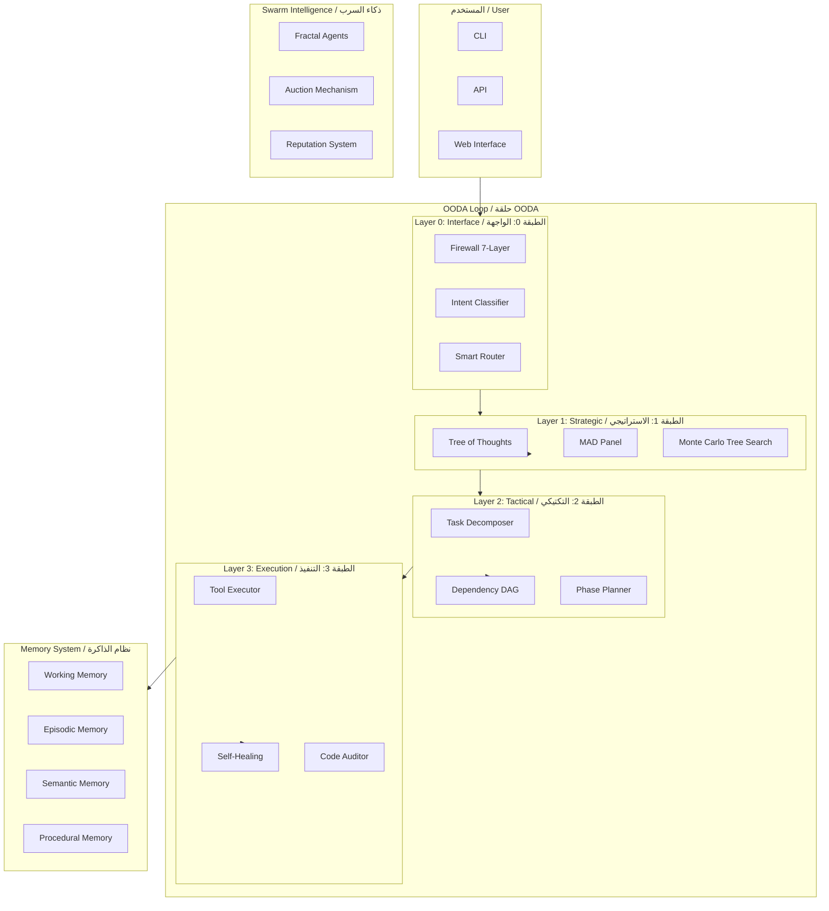

### 1.3 OODA Loop / حلقة OODA

The OODA (Observe-Orient-Decide-Act) loop is the core cognitive cycle:

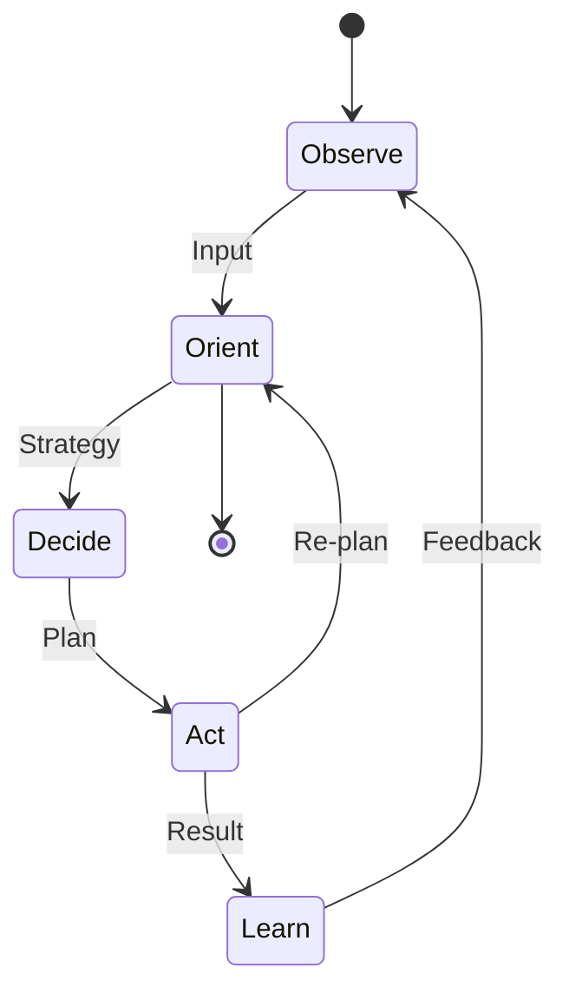

| Phase / المرحلة | Layer / الطبقة | Component / المكون | Responsibility / المسؤولية |
|----------------|----------------|--------------------|---------------------------|
| **Observe** | L0 | `PromptFirewall` | Security scanning, intent classification, environment sensing / فحص الأمان، تصنيف النية، استشعار البيئة |
| **Orient** | L1 | `StrategicToT` | Deep Research (STORM) and Strategy Generation / البحث العميق وتوليد الاستراتيجية |
| **Decide** | L2 | `TacticalDecomposer` | Task breakdown and dependency graph construction / تفكيك المهام وبناء رسم بياني للتبعيات |
| **Act** | L3 | `SpecializedExecutors` | Action execution with Tool Synthesis / تنفيذ الإجراءات مع تركيب الأدوات |
| **Learn** | Meta | `Metacognition` | Reflective learning and reputation updates / التعلم التأملي وتحديثات السمعة |

---

## 2. Layer Architecture / معمارية الطبقات

### 2.1 Layer 0: Interface / الطبقة 0: الواجهة

#### Purpose / الغرض

Layer 0 is the entry point for all GAAP requests. It provides security scanning, intent classification, complexity estimation, and smart routing decisions.

الطبقة 0 هي نقطة الدخول لجميع طلبات GAAP. توفر فحص الأمان، تصنيف النية، تقدير التعقيد، وقرارات التوجيه الذكي.

#### Components / المكونات

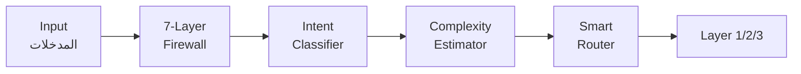

| Component / المكون | File / الملف | Description / الوصف |
|-------------------|--------------|---------------------|
| `PromptFirewall` | `gaap/security/firewall.py` | 7-layer security scanning / فحص أمان من 7 طبقات |
| `IntentClassifier` | `gaap/layers/layer0_interface.py` | 11 intent types classification / تصنيف 11 نوع نية |
| `ComplexityEstimator` | `gaap/layers/layer0_interface.py` | Task complexity scoring / تقدير تعقيد المهمة |
| `SmartRouter` | `gaap/routing/router.py` | Dynamic routing to L1/L2/L3 / التوجيه الديناميكي |

#### Flow / التدفق

1. **Input Reception**: User request enters Layer 0 / استقبال المدخلات: يدخل طلب المستخدم الطبقة 0
2. **Security Scan**: 7-layer firewall checks for threats / فحص الأمان: يفحص جدار الحماية المكون من 7 طبقات للتهديدات
3. **Intent Classification**: Classifies into 11 intent types / تصنيف النية: يصنف إلى 11 نوع نية
4. **Complexity Estimation**: Estimates task complexity (SIMPLE/MODERATE/COMPLEX/CRITICAL) / تقدير التعقيد: يقدر تعقيد المهمة
5. **Routing Decision**: Routes to Strategic (L1), Tactical (L2), or Direct (L3) / قرار التوجيه: يوجه إلى الاستراتيجي أو التكتيكي أو المباشر

---

### 2.2 Layer 1: Strategic (Think) / الطبقة 1: الاستراتيجي (التفكير)

#### Purpose / الغرض

Layer 1 handles high-level strategic planning using Tree of Thoughts (ToT), MAD (Multi-Agent Debate) Panel, and Monte Carlo Tree Search (MCTS) for complex decision-making.

الطبقة 1 تتعامل مع التخطيط الاستراتيجي عالي المستوى باستخدام شجرة الأفكار (ToT)، ولوحة MAD (النقاش متعدد الوكلاء)، وشجرة البحث مونت كارلو (MCTS) لاتخاذ القرارات المعقدة.

#### Components / المكونات

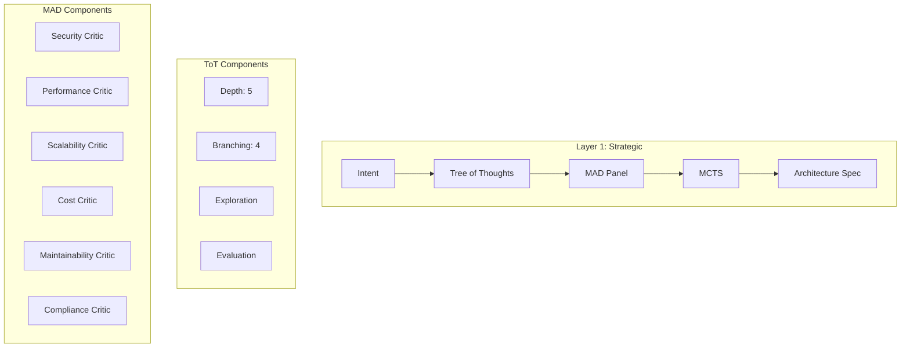

| Component / المكون | File / الملف | Description / الوصف |
|-------------------|--------------|---------------------|
| `ToTStrategic` | `gaap/layers/layer1_strategic.py` | Tree of Thoughts with depth=5, branching=4 / شجرة الأفكار بعمق 5 وتفرع 4 |
| `MADPanel` | `gaap/mad/critic_prompts.py` | 6 architecture critics / 6 نقاد معماريين |
| `MCTSStrategic` | `gaap/layers/mcts_logic.py` | Monte Carlo Tree Search for COMPLEX tasks / شجرة البحث مونت كارلو للمهام المعقدة |
| `WisdomDistiller` | `gaap/meta_learning/wisdom_distiller.py` | Extracts patterns from history / يستخرج الأنماط من التاريخ |

#### Flow / التدفق

1. **Input Processing**: Receives structured intent from Layer 0 / معالجة المدخلات: يستقبل النية المهيكلة من الطبقة 0
2. **ToT Exploration**: Explores multiple solution paths (depth=5, branching=4) / استكشاف ToT: يستكشف مسارات الحل المتعددة
3. **MAD Debate**: 6 critics evaluate each path / نقاش MAD: يقيم 6 نقاد كل مسار
4. **MCTS Search**: For COMPLEX/CRITICAL tasks, uses MCTS for optimal path / بحث MCTS: للمهام المعقدة/الحرجة، يستخدم MCTS للمسار الأمثل
5. **Architecture Generation**: Produces ArchitectureSpec / توليد المعمارية: ينتج مواصفات المعمارية

---

### 2.3 Layer 2: Tactical (Plan) / الطبقة 2: التكتيكي (التخطيط)

#### Purpose / الغرض

Layer 2 decomposes strategic plans into executable tasks using Task Decomposition and builds a Directed Acyclic Graph (DAG) for dependency management.

الطبقة 2 تفكك الخطط الاستراتيجية إلى مهام قابلة للتنفيذ باستخدام تفكيك المهام وتبني رسم بياني غير دوري موجه (DAG) لإدارة التبعيات.

#### Components / المكونات

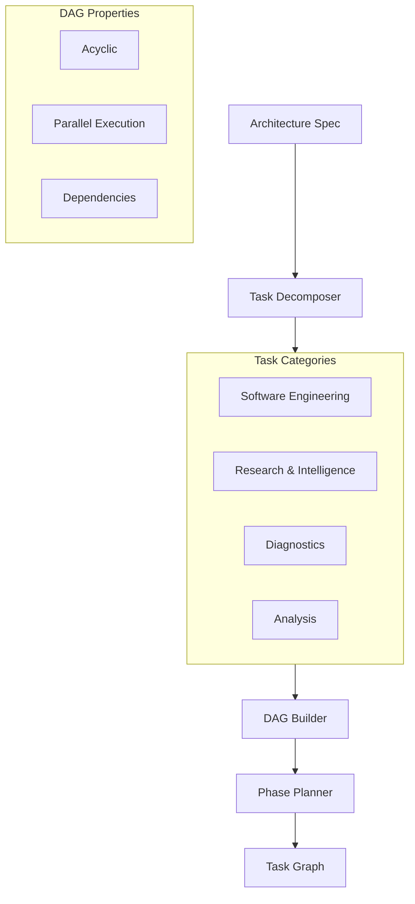

| Component / المكون | File / الملف | Description / الوصف |
|-------------------|--------------|---------------------|
| `TacticalDecomposer` | `gaap/layers/layer2_tactical.py` | Multi-domain task breakdown / تفكيك المهام متعدد المجالات |
| `TaskGraph` | `gaap/layers/layer2_tactical.py` | DAG construction / بناء الرسم البياني |
| `PhasePlanner` | `gaap/layers/phase_planner.py` | Phase discovery and planning / اكتشاف المراحل والتخطيط |
| `SemanticDependencies` | `gaap/layers/semantic_dependencies.py` | Semantic dependency resolution / حل التبعيات الدلالية |

#### Flow / التدفق

1. **Task Decomposition**: Breaks architecture spec into atomic tasks / تفكيك المهام: يكسر مواصفات المعمارية إلى مهام ذرية
2. **Category Classification**: Categorizes tasks (SETUP, DATABASE, API, FRONTEND, TESTING, SECURITY, etc.) / تصنيف الفئات: يصنف المهام
3. **DAG Construction**: Builds dependency graph ensuring no cycles / بناء DAG: يبني رسم التبعيات بدون دورات
4. **Phase Planning**: Groups tasks into executable phases / تخطيط المراحل: يجمع المهام في مراحل قابلة للتنفيذ
5. **Semantic Resolution**: Resolves cross-domain dependencies / الحل الدلالي: يحل التبعيات عبر المجالات

---

### 2.4 Layer 3: Execution (Act) / الطبقة 3: التنفيذ (الفعل)

#### Purpose / الغرض

Layer 3 executes tasks using specialized executors, includes self-healing capabilities for automatic error recovery, and performs code auditing.

الطبقة 3 تنفذ المهام باستخدام المنفذين المتخصصين، تشمل قدرات الشفاء الذاتي للتعافي التلقائي من الأخطاء، وتقوم بتدقيق الكود.

#### Components / المكونات

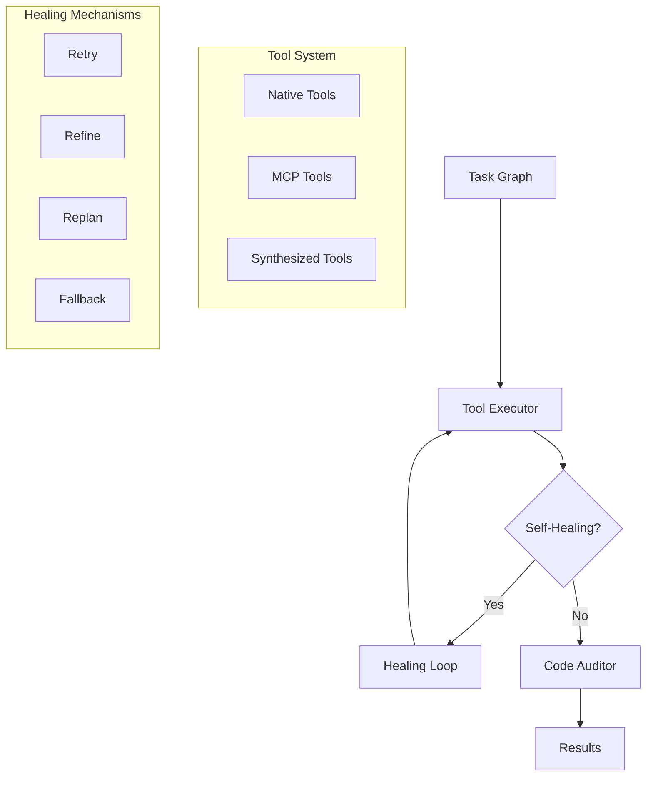

| Component / المكون | File / الملف | Description / الوصف |
|-------------------|--------------|---------------------|
| `Layer3Execution` | `gaap/layers/layer3_execution.py` | Main execution engine / محرك التنفيذ الرئيسي |
| `NativeToolCaller` | `gaap/layers/native_function_caller.py` | Native function execution / تنفيذ الدوال الأصلية |
| `ToolSynthesizer` | `gaap/tools/synthesizer.py` | Dynamic tool synthesis / تركيب الأدوات الديناميكي |
| `SelfHealingSystem` | `gaap/healing/healer.py` | Error detection and recovery / اكتشاف الأخطاء والتعافي |
| `CodeAuditor` | `gaap/layers/code_auditor.py` | Code quality verification / التحقق من جودة الكود |

#### Flow / التدفق

1. **Task Selection**: Selects next executable task from DAG / اختيار المهمة: يختار المهمة التالية القابلة للتنفيذ من DAG
2. **Tool Selection**: Chooses appropriate tool (native/MCP/synthesized) / اختيار الأداة: يختار الأداة المناسبة
3. **Execution**: Runs the tool with parameters / التنفيذ: يشغل الأداة بالمعلمات
4. **Self-Healing**: On error, attempts retry → refine → replan → fallback / الشفاء الذاتي: عند الخطأ، يحاول إعادة المحاولة → التحسين → إعادة التخطيط → البديل
5. **Auditing**: Verifies output quality / التدقيق: يتحقق من جودة المخرجات

---

## 3. Memory System / نظام الذاكرة

GAAP implements a 4-tier hierarchical memory system inspired by human memory architecture:

```mermaid
flowchart TB
    subgraph MemoryTiers["Memory Tiers / طبقات الذاكرة"]
        L1[L1: Working Memory<br/>ذاكرة العمل]
        L2[L2: Episodic Memory<br/>ذاكرة الأحداث]
        L3[L3: Semantic Memory<br/>ذاكرة دلالية]
        L4[L4: Procedural Memory<br/>ذاكرة إجرائية]
    end
    
    Input[Experience] --> L1
    L1 --> L2 : Consolidation
    L2 --> L3 : Abstraction
    L3 --> L4 : Proceduralization
    
    L1 <--> L2 : Short-term
    L2 <--> L3 : Medium-term
    L3 <--> L4 : Long-term
```

### 3.1 Memory Tiers / طبقات الذاكرة

| Tier / الطبقة | Type / النوع | Capacity / السعة | Purpose / الغرض |
|--------------|-------------|-----------------|-----------------|
| **L1: Working** | `WorkingMemory` | 100 items | Fast access to current context / الوصول السريع للسياق الحالي |
| **L2: Episodic** | `EpisodicMemory` | Unlimited | Event history and learning / تاريخ الأحداث والتعلم |
| **L3: Semantic** | `SemanticMemory` | Unlimited | Patterns and extracted knowledge / الأنماط والمعرفة المستخرجة |
| **L4: Procedural** | `ProceduralMemory` | Unlimited | Skills and procedures / المهارات والإجراءات |

### 3.2 Dream Cycle / دورة الأحلام

The Dream Cycle consolidates episodic memories into semantic patterns during idle periods:

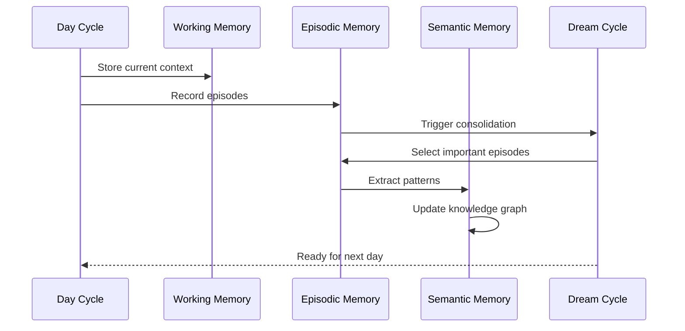

**File**: `gaap/memory/hierarchical.py`

---

## 4. Meta-Learning / التعلم الوصفي

### 4.1 Confidence Scoring / تقدير الثقة

GAAP implements metacognitive confidence scoring to self-assess decision quality:

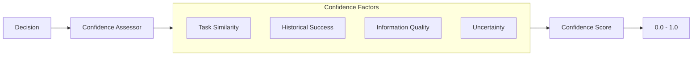

**File**: `gaap/core/confidence_scorer.py`

### 4.2 Wisdom Distillation / تقطير الحكمة

Extracts actionable insights from episodic memories:

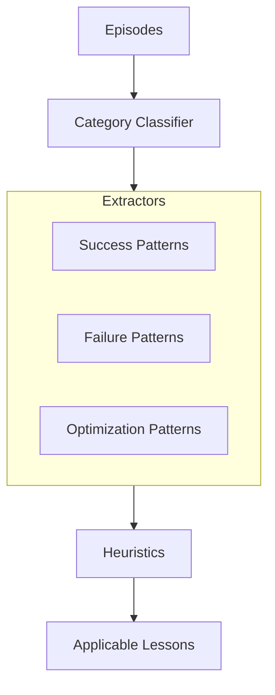

**File**: `gaap/meta_learning/wisdom_distiller.py`

### 4.3 Failure Learning / تعلم الفشل

Tracks and learns from execution failures:

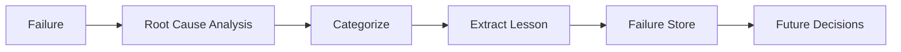

**File**: `gaap/meta_learning/failure_store.py`

---

## 5. Swarm Intelligence / ذكاء السرب

### 5.1 Fractal Agents / الوكلاء المتشققين

Fractals are specialized sub-agents with domain expertise:

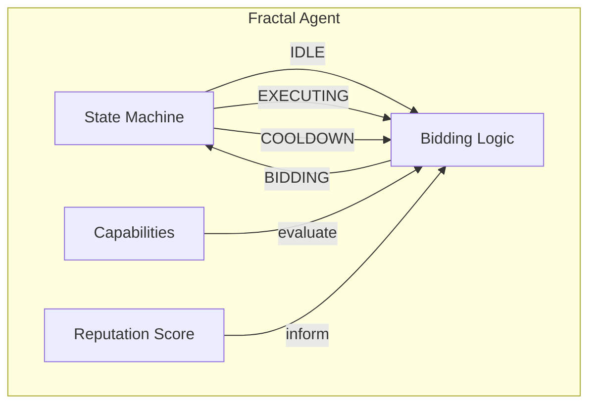

**File**: `gaap/swarm/fractal.py`

### 5.2 Reputation System / نظام السمعة

Domain-aware reputation tracking:

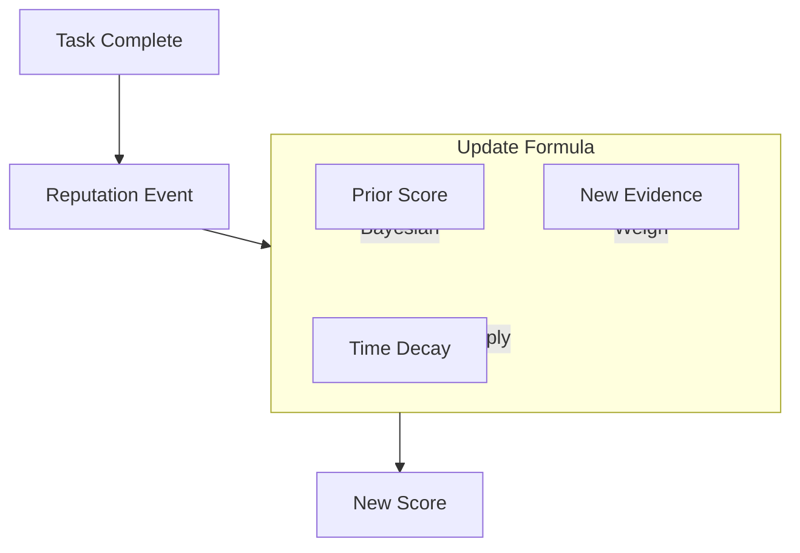

**File**: `gaap/swarm/reputation.py`

### 5.3 Auction Mechanism / آلية المزاد

Reputation-Based Task Auction (RBTA):

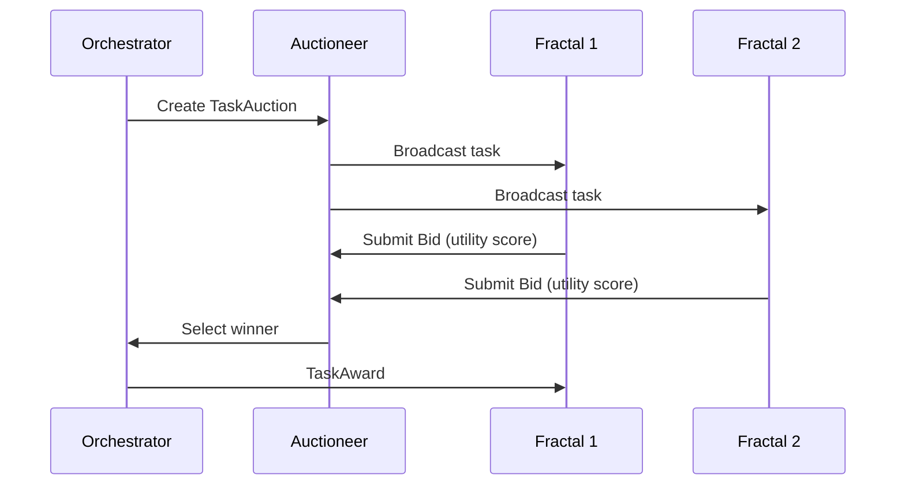

**File**: `gaap/swarm/auction.py`

---

## 6. Security / الأمان

### 6.1 Firewall Layers / طبقات الجدار الناري

7-layer security defense system:

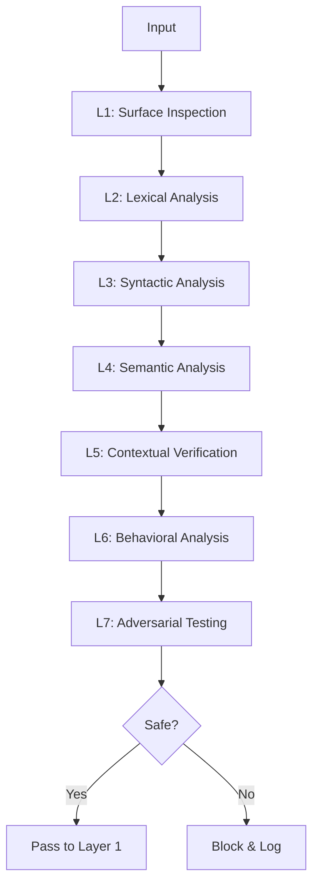

| Layer / الطبقة | Check / الفحص |
|---------------|--------------|
| L1: Surface | Basic pattern matching / مطابقة الأنماط الأساسية |
| L2: Lexical | Token analysis / تحليل الرموز |
| L3: Syntactic | Structure validation / التحقق من البنية |
| L4: Semantic | Meaning analysis / تحليل المعنى |
| L5: Contextual | Context verification / التحقق من السياق |
| L6: Behavioral | Behavior monitoring / مراقبة السلوك |
| L7: Adversarial | Attack simulation / محاكاة الهجوم |

**File**: `gaap/security/firewall.py`

### 6.2 Sandbox Execution / التنفيذ في بيئة معزولة

Tools execute in isolated environments:

**File**: `gaap/security/sandbox.py`

### 6.3 Input Validation / التحقق من المدخلات

Strict input validation at Layer 0:

**File**: `gaap/security/preflight.py`

---

## 7. Web Interface / واجهة الويب

### 7.1 Frontend Stack / تقنيات الواجهة الأمامية

```mermaid
flowchart LR
    subgraph Frontend["Frontend / الواجهة الأمامية"]
        NextJS[Next.js 14]
        React[React 18]
        Tailwind[Tailwind CSS]
        State[Zustand]
        Query[React Query]
        Charts[Recharts]
        Graph[@xyflow React]
    end
    
    NextJS --> React
    React --> Tailwind
    React --> State
    React --> Query
    Query --> Charts
    Query --> Graph
```

**Stack**:
- **Framework**: Next.js 14
- **UI**: React 18, Tailwind CSS
- **State**: Zustand
- **Data Fetching**: React Query
- **Visualization**: Recharts, @xyflow/react
- **Animations**: Framer Motion

**File**: `frontend/package.json`

### 7.2 Backend API / واجهة API الخلفية

FastAPI-based REST API:

```mermaid
flowchart TB
    subgraph API["REST API"]
        Tasks[/api/tasks]
        Sessions[/api/sessions]
        Memory[/api/memory]
        System[/api/system]
        Providers[/api/providers]
        Research[/api/research]
    end
    
    Tasks --> DB[(SQLite)]
    Sessions --> DB
    Memory --> DB
    System --> Observability
```

**Files**:
- `gaap/api/tasks.py`
- `gaap/api/sessions.py`
- `gaap/api/memory.py`
- `gaap/api/system.py`
- `gaap/api/providers.py`
- `gaap/api/research.py`

### 7.3 WebSocket / ويب سوكت

Real-time event streaming:

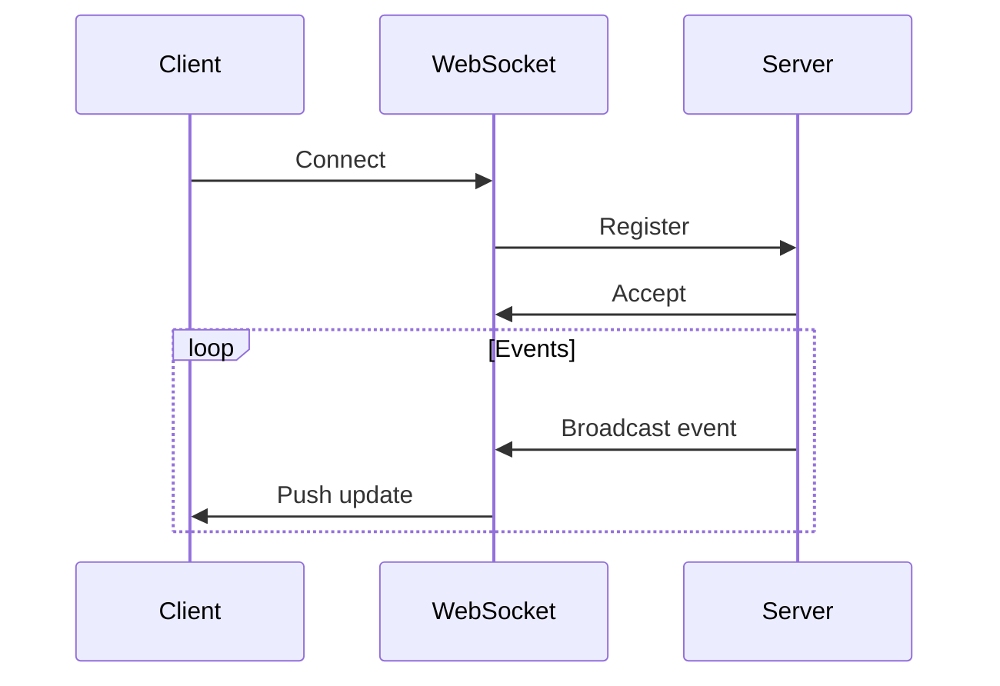

**Channels**:
- `events`: General system events
- `ooda`: OODA loop progress
- `steering`: User steering commands

**File**: `gaap/api/websocket.py`

---

## 8. Key Files / الملفات الرئيسية

### Core Engine / محرك الأساسي

| File / الملف | Description / الوصف |
|-------------|-------------------|
| `gaap/gaap_engine.py` | Main OODA loop engine / محرك حلقة OODA الرئيسي |
| `gaap/core/types.py` | Core type definitions / تعريفات الأنواع الأساسية |
| `gaap/core/config.py` | Configuration management / إدارة التكوين |

### Layers / الطبقات

| File / الملف | Description / الوصف |
|-------------|-------------------|
| `gaap/layers/layer0_interface.py` | Interface layer / الطبقةinterface |
| `gaap/layers/layer1_strategic.py` | Strategic layer (ToT, MAD, MCTS) / الطبقة الاستراتيجية |
| `gaap/layers/layer2_tactical.py` | Tactical layer (DAG, decomposition) / الطبقة التكتيكية |
| `gaap/layers/layer3_execution.py` | Execution layer (tools, healing) / الطبقة التنفيذية |

### Memory / الذاكرة

| File / الملف | Description / الوصف |
|-------------|-------------------|
| `gaap/memory/hierarchical.py` | 4-tier memory system / نظام الذاكرة رباعي الطبقات |
| `gaap/memory/vector_backends.py` | Vector storage backends / واجهات التخزين المتجهة |

### Security / الأمان

| File / الملف | Description / الوصف |
|-------------|-------------------|
| `gaap/security/firewall.py` | 7-layer prompt firewall / جدار الحماية |
| `gaap/security/sandbox.py` | Sandboxed execution / التنفيذ المعزول |
| `gaap/security/preflight.py` | Input validation / التحقق من المدخلات |

### Swarm / السرب

| File / الملف | Description / الوصف |
|-------------|-------------------|
| `gaap/swarm/fractal.py` | Fractal agent implementation / تنفيذ الوكيل المتشقق |
| `gaap/swarm/reputation.py` | Reputation system / نظام السمعة |
| `gaap/swarm/auction.py` | Auction mechanism / آلية المزاد |
| `gaap/swarm/orchestrator.py` | Swarm orchestration / تنسيق السرب |

### Meta-Learning / التعلم الوصفي

| File / الملف | Description / الوصف |
|-------------|-------------------|
| `gaap/meta_learning/confidence.py` | Confidence scoring / تقدير الثقة |
| `gaap/meta_learning/wisdom_distiller.py` | Wisdom extraction / استخراج الحكمة |
| `gaap/meta_learning/failure_store.py` | Failure learning / تعلم الفشل |

### API / واجهة برمجة التطبيقات

| File / الملف | Description / الوصف |
|-------------|-------------------|
| `gaap/api/websocket.py` | WebSocket manager / مدير ويب سوكت |
| `gaap/api/tasks.py` | Task endpoints / نقاط نهاية المهام |
| `gaap/api/memory.py` | Memory endpoints / نقاط نهاية الذاكرة |
| `gaap/api/system.py` | System health / صحة النظام |

### Frontend / الواجهة الأمامية

| File / الملف | Description / الوصف |
|-------------|-------------------|
| `frontend/src/lib/api.ts` | API client / عميل API |
| `frontend/src/hooks/useWebSocket.ts` | WebSocket hook / خطاف ويب سوكت |
| `frontend/src/components/ooda/` | OODA visualization components / مكونات تصور OODA |

---

## Project Statistics / إحصائيات المشروع

- **Specifications Implemented**: 38 (73%)
- **Lines of Code**: ~90,000
- **Tests**: 1,500+
- **Test Coverage**: ~55%

---

**GAAP: The future of autonomous cognitive engineering**  
**GAAP: مستقبل هندسة認知 المستقلة**
