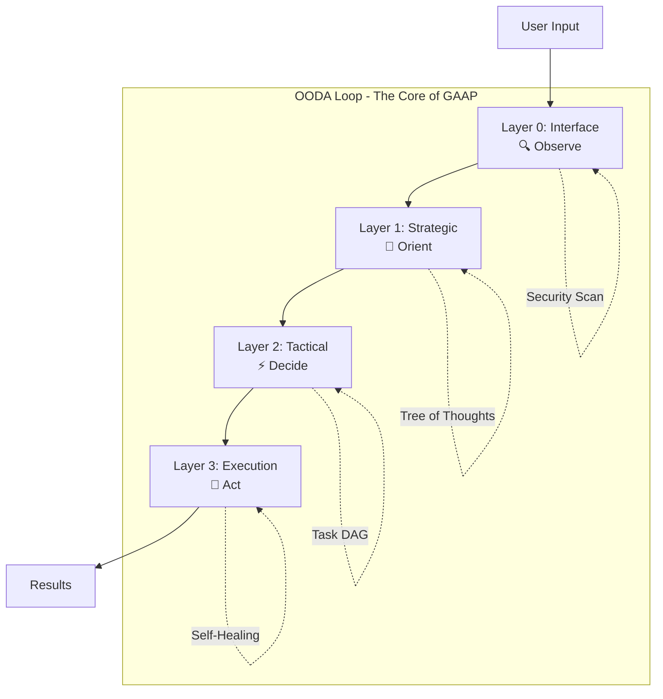
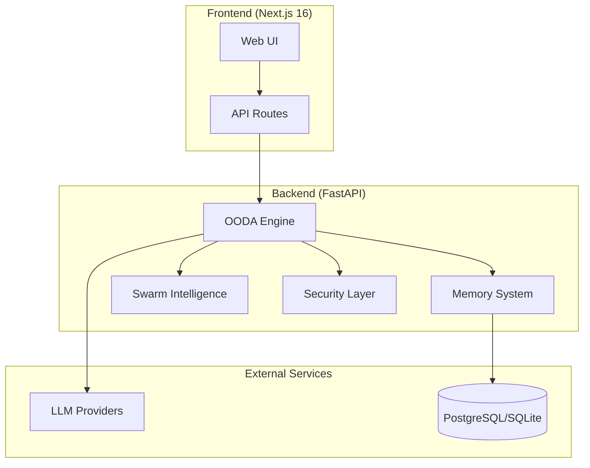

# 🚀 GAAP - General AI Assistant Platform

<div align="center">

[](https://github.com/yourusername/gaap/actions)
[](./frontend/src/test)
[](https://www.python.org/)
[](https://www.typescriptlang.org/)
[](https://nextjs.org/)
[](LICENSE)

**Autonomous AI Coding Agent with OODA Cognitive Architecture**

[Quick Start](docs/users/quickstart.md) • [Documentation](docs/) • [API Reference](docs/api/README.md) • [Deployment](docs/deployment/README.md)

</div>

---

## ✨ What is GAAP?

GAAP (General AI Assistant Platform) is an autonomous AI coding agent powered by a 4-layer **OODA cognitive architecture** (Observe-Orient-Decide-Act). It combines multiple LLM providers, self-healing capabilities, and swarm intelligence into a unified cognitive system.

### Why GAAP?

- 🤖 **Multi-Provider AI**: Seamlessly switches between Kimi, DeepSeek, GLM, and more
- 🧠 **OODA Architecture**: Military-grade decision-making for code generation
- 🔄 **Self-Healing**: Automatically recovers from errors without user intervention
- 💬 **Real-Time Streaming**: Chat interface with live response streaming
- 📊 **Full Observability**: Monitor every phase of the cognitive cycle
- 🔒 **Enterprise Security**: 7-layer security firewall built-in

---

## 🚀 Quick Start

### Prerequisites

- Python 3.10+
- Node.js 18+
- Git

### Installation

```bash
# Clone repository
git clone https://github.com/yourusername/gaap.git
cd gaap

# Setup backend
python -m venv .venv
source .venv/bin/activate
pip install -e ".[dev]"

# Setup frontend
cd frontend
npm install
cp .env.example .env.local

# Start services
./start_full_system.sh
```

Access GAAP at http://localhost:3000

### Docker (Recommended for Production)

```bash
# Start all services
docker-compose up -d

# Check status
docker-compose ps
```

---

## 🎯 Features

### 🧠 OODA Cognitive Architecture



| Phase | What It Does | Example |
|-------|--------------|---------|
| **Observe** | Security scan, intent classification, complexity estimation | "Create a REST API" → CODE_GENERATION intent |
| **Orient** | Strategic planning using Tree of Thoughts, MAD panel | Generate architecture options, debate with critics |
| **Decide** | Task decomposition, DAG construction, phase planning | Break into: setup, database, API, frontend, tests |
| **Act** | Tool execution with self-healing | Execute, retry on failure, refine, complete |

### 🤖 Multi-Provider AI

Seamlessly integrates multiple LLM providers with automatic failover:

```python
# Automatic provider fallback
providers = ["kimi", "deepseek", "glm"]
# If Kimi fails, automatically tries DeepSeek, then GLM
```

Supported providers:
- **Kimi** (default): kimi-k2.5-thinking
- **DeepSeek**: deepseek-chat
- **GLM**: GLM-5

### 💬 Chat Interface

Real-time chat with streaming responses:

```bash
# Via API
curl -X POST http://localhost:8000/api/chat \
  -H "Content-Type: application/json" \
  -d '{"message": "Create a Python REST API"}'
```

Features:
- Markdown support with code highlighting
- Real-time streaming
- Session management
- Usage tracking

### 📊 Session Management

Organize work into sessions:

```bash
# Create session
curl -X POST http://localhost:8000/api/sessions \
  -d '{"name": "Auth Module", "priority": "high", "tags": ["backend", "security"]}'

# List sessions
curl http://localhost:8000/api/sessions

# Export session
curl -X POST http://localhost:8000/api/sessions/{id}/export
```

### 🔒 Security

7-layer security defense:

```
┌─────────────────────────────────────────┐
│ L1: Surface - Pattern matching          │
│ L2: Lexical - Token analysis              │
│ L3: Syntactic - Structure validation      │
│ L4: Semantic - Meaning analysis           │
│ L5: Contextual - Context verification     │
│ L6: Behavioral - Behavior monitoring      │
│ L7: Adversarial - Attack simulation       │
└─────────────────────────────────────────┘
```

### 📈 Observability

Built-in monitoring and metrics:

```bash
# Health check
curl http://localhost:8000/api/health

# Prometheus metrics
curl http://localhost:8000/metrics

# System metrics
curl http://localhost:8000/api/system/metrics
```

---

## 🏗️ Architecture



---

## 📁 Project Structure

```
gaap/
├── gaap/                      # Python backend
│   ├── api/                   # FastAPI endpoints
│   │   ├── main.py           # Main application
│   │   ├── chat.py           # Chat endpoints
│   │   ├── sessions.py       # Session management
│   │   ├── providers.py      # Provider management
│   │   └── system.py         # System endpoints
│   ├── layers/               # OODA layers
│   │   ├── layer0_interface.py
│   │   ├── layer1_strategic.py
│   │   ├── layer2_tactical.py
│   │   └── layer3_execution.py
│   ├── memory/               # Hierarchical memory system
│   ├── security/             # Security components
│   └── providers/            # LLM provider implementations
│
├── frontend/                  # Next.js frontend
│   ├── src/
│   │   ├── app/              # App router
│   │   ├── components/       # React components
│   │   └── hooks/            # Custom hooks
│   └── package.json
│
├── docs/                      # Documentation
│   ├── api/                   # API docs
│   ├── developers/            # Developer guide
│   ├── deployment/            # Deployment guide
│   ├── users/                 # User guide
│   └── adrs/                  # Architecture decisions
│
├── docker-compose.yml         # Docker orchestration
└── README.md                  # This file
```

---

## 📚 Documentation

### For Users

- [Quick Start](docs/users/quickstart.md) - Get running in 5 minutes
- [Provider Setup](docs/users/providers.md) - Configure AI providers
- [Web Interface](docs/users/web-interface.md) - Using the web UI

### For Developers

- [Developer Guide](docs/developers/README.md) - Project overview
- [Setup Guide](docs/developers/setup.md) - Development environment
- [Architecture](docs/developers/architecture.md) - System architecture
- [Contributing](docs/developers/contributing.md) - Contribution guidelines

### For Operators

- [Deployment Guide](docs/deployment/README.md) - Production deployment
- [Docker Setup](docs/deployment/docker.md) - Docker deployment
- [Kubernetes](docs/deployment/kubernetes.md) - K8s manifests
- [Monitoring](docs/deployment/monitoring.md) - Observability

### API Reference

- [API Overview](docs/api/README.md) - Authentication and basics
- [Endpoints](docs/api/endpoints.md) - Complete endpoint reference
- [WebSocket](docs/api/websocket.md) - Real-time events

### Architecture

- [ADR-001: Why OODA](docs/adrs/001-why-ooda.md)
- [ADR-002: Database Choice](docs/adrs/002-database-choice.md)
- [ADR-003: Provider Abstraction](docs/adrs/003-provider-abstraction.md)

---

## 🧪 Testing

```bash
# Backend tests
pytest

# Frontend tests
cd frontend && npm test

# With coverage
pytest --cov=gaap
npm run test:coverage
```

---

## 🤝 Contributing

We welcome contributions! See our [Contributing Guide](docs/developers/contributing.md) for:

- Code style guidelines
- Testing requirements
- PR process
- Commit conventions

---

## 📄 License

MIT License - see [LICENSE](LICENSE) file for details.

---

<div align="center">

**Made with ❤️ by the GAAP Team**

[⬆ Back to Top](#-gaap---general-ai-assistant-platform)

</div>
