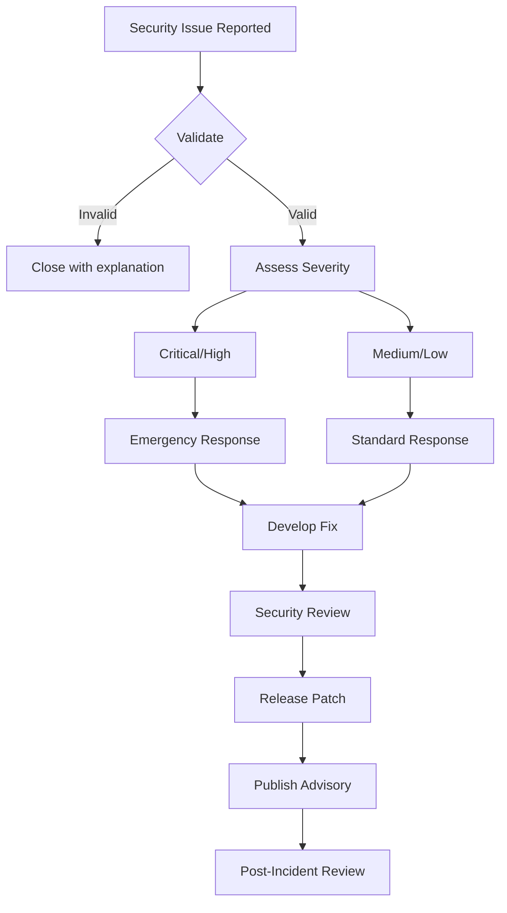

# Security Policy

This document outlines the security policy for the GAAP (General-purpose AI Architecture Platform) project, including supported versions, vulnerability reporting procedures, and security best practices.

## Supported Versions

The following table outlines which versions of GAAP are currently receiving security updates:

| Version | Supported          | Notes                              |
|---------|-------------------|------------------------------------|
| 0.9.x   | ✅ Active support  | Current stable release             |
| 0.8.x   | ⚠️ Security fixes only | Transitioning to maintenance  |
| < 0.8.0 | ❌ Not supported   | Please upgrade to latest version   |

### Support Timeline

- **Active Support**: Full bug fixes, security patches, and new features
- **Security Fixes Only**: Critical security patches only
- **Not Supported**: No updates provided; upgrade required

## Reporting a Vulnerability

We take security vulnerabilities seriously. If you discover a security issue, please report it responsibly.

### How to Report

**Please DO NOT** create a public GitHub issue for security vulnerabilities.

Instead, report security issues via:

1. **Email**: Send details to [security@gaap.io](mailto:security@gaap.io)
2. **GitHub Security Advisories**: Use [GitHub's private vulnerability reporting](https://github.com/gaap-system/gaap/security/advisories/new)

### What to Include

When reporting a vulnerability, please include:

- **Description**: Clear description of the vulnerability
- **Impact**: What could an attacker achieve?
- **Reproduction**: Step-by-step instructions to reproduce
- **Affected versions**: Which versions are impacted?
- **Environment**: Operating system, Python version, etc.
- **Proof of concept**: If applicable, provide PoC code
- **Suggested fix**: If you have a proposed solution

### Response Timeline

| Timeframe | Action                                              |
|-----------|-----------------------------------------------------|
| 24 hours  | Acknowledgment of receipt                           |
| 72 hours  | Initial assessment and classification               |
| 7 days    | Detailed response with mitigation plan              |
| 30 days   | Target fix timeline for critical vulnerabilities   |
| 90 days   | Maximum disclosure timeline (coordinated)          |

### Disclosure Policy

We follow a **coordinated disclosure** approach:

1. We work with reporters to validate and fix vulnerabilities
2. We aim to release patches before public disclosure
3. We credit reporters who follow responsible disclosure (unless anonymous)
4. We publish security advisories after fixes are available

## Security Best Practices

### For Users

#### API Key Management

- **Never** hardcode API keys in your code
- Use environment variables or secure secret management:
  ```bash
  export OPENAI_API_KEY="your-key-here"
  ```
- Rotate API keys regularly (recommended: every 90 days)
- Use separate keys for development and production
- Monitor API usage for anomalies

#### Environment Configuration

```bash
# Create .env file (never commit this!)
cp .env.example .env

# Edit with your settings
nano .env

# Ensure .env is in .gitignore
cat .gitignore | grep "\.env"
```

#### Running GAAP Securely

1. **Use Docker with limited privileges**:
   ```bash
   docker run --security-opt=no-new-privileges gaap:latest
   ```

2. **Enable audit logging**:
   ```yaml
   # config/security.yml
   audit_logging:
     enabled: true
     level: INFO
   ```

3. **Use network policies**:
   - Restrict outbound connections
   - Use internal networks for inter-service communication

4. **Regular updates**:
   ```bash
   pip install --upgrade gaap
   ```

### For Developers

#### Code Security

1. **Input validation**: Always validate and sanitize user inputs
2. **Parameterized queries**: Never use string concatenation for SQL
3. **Secure deserialization**: Use `json` instead of `pickle` for untrusted data
4. **Avoid eval/exec**: Never use `eval()` or `exec()` with user input

#### Secure Coding Patterns

```python
# ❌ BAD: SQL injection risk
query = f"SELECT * FROM users WHERE id = {user_id}"

# ✅ GOOD: Parameterized query
query = "SELECT * FROM users WHERE id = %s"
cursor.execute(query, (user_id,))

# ❌ BAD: Unsafe deserialization
import pickle
data = pickle.loads(untrusted_data)

# ✅ GOOD: Safe deserialization
import json
data = json.loads(untrusted_data)

# ❌ BAD: Command injection
import os
os.system(f"echo {user_input}")

# ✅ GOOD: Safe subprocess
import subprocess
subprocess.run(["echo", user_input], shell=False)
```

#### Dependency Management

1. **Pin dependencies** in `requirements.txt`:
   ```
   requests==2.31.0
   ```

2. **Regular security scans**:
   ```bash
   # Run security audit
   make security-audit

   # Or manually
   python scripts/security/audit-codebase.py
   python scripts/security/check-dependencies.py
   ```

3. **Automated updates** with Dependabot (enabled by default)

## Incident Response

### Severity Levels

| Level | Description | Response Time | Examples |
|-------|-------------|---------------|----------|
| Critical | System compromise, data breach | 24 hours | RCE, SQL injection, auth bypass |
| High | Significant security impact | 72 hours | XSS, CSRF, privilege escalation |
| Medium | Limited security impact | 7 days | Information disclosure, DoS |
| Low | Minor security concern | 30 days | Best practice violations |

### Incident Response Process



### Emergency Contacts

For critical security incidents requiring immediate attention:

- **Security Team**: security@gaap.io
- **Emergency Line**: +1-XXX-XXX-XXXX (24/7)
- **GPG Key**: [Download public key](./security-team.pub)

## Security Features

### Built-in Security

GAAP includes several security features:

1. **Sandboxed Code Execution**: Docker-based isolation
2. **Input Validation**: Pydantic models for all inputs
3. **Audit Logging**: Comprehensive activity logging
4. **Rate Limiting**: Built-in API rate limiting
5. **Authentication**: Multiple auth provider support

### Security Configuration

```yaml
# config/security.yml
security:
  # Authentication
  auth:
    required: true
    providers:
      - jwt
      - api_key

  # Rate limiting
  rate_limit:
    enabled: true
    requests_per_minute: 60
    burst_size: 10

  # Sandboxing
  sandbox:
    enabled: true
    docker:
      image: "gaap-sandbox:latest"
      memory_limit: "512m"
      cpu_limit: "1.0"
      network_disabled: true

  # Audit logging
  audit:
    enabled: true
    level: INFO
    retention_days: 90
```

## Security Scanning

### Automated Scanning

The following security scans run automatically:

| Tool | Purpose | Frequency | Blocking |
|------|---------|-----------|----------|
| Bandit | Python security linter | Every PR | Main branch only |
| Safety | Dependency vulnerabilities | Every PR | Main branch only |
| pip-audit | PyPA security audit | Every PR | Main branch only |
| CodeQL | GitHub security analysis | Weekly | Main branch only |
| Gitleaks | Secret scanning | Every push | Always |
| Custom Audit | Custom security rules | Every PR | Main branch only |

### Manual Scanning

Run security scans manually:

```bash
# Full security audit
make security-audit

# Individual scans
python scripts/security/audit-codebase.py
python scripts/security/check-dependencies.py

# With specific options
python scripts/security/audit-codebase.py --fail-on high --format json
python scripts/security/check-dependencies.py --fail-on-vuln
```

## Security Checklist

Before deploying GAAP in production:

- [ ] Change all default passwords
- [ ] Enable authentication
- [ ] Configure HTTPS/TLS
- [ ] Set up audit logging
- [ ] Enable rate limiting
- [ ] Configure CORS appropriately
- [ ] Set up secret management (Vault, AWS Secrets Manager, etc.)
- [ ] Enable Docker sandboxing
- [ ] Configure network policies
- [ ] Set up monitoring and alerting
- [ ] Review and harden configuration files
- [ ] Run security audit: `make security-audit`
- [ ] Review dependencies: `python scripts/security/check-dependencies.py`
- [ ] Set up automated security updates (Dependabot)
- [ ] Document incident response procedures
- [ ] Train team on security policies

## Compliance

### Standards

GAAP aims to comply with the following security standards:

- **OWASP Top 10**: Addressed through secure coding practices
- **CIS Benchmarks**: Configuration hardening guidelines
- **SOC 2**: Security controls for SaaS deployments

### Certifications

Planned security certifications:

- [ ] SOC 2 Type II
- [ ] ISO 27001
- [ ] GDPR compliance verification

## Acknowledgments

We thank the following security researchers who have responsibly disclosed vulnerabilities:

- *To be populated as reports are received*

## Updates to This Policy

This security policy is reviewed and updated quarterly. Last updated: 2024-02-27

### Changelog

| Date | Version | Changes |
|------|---------|---------|
| 2024-02-27 | 1.0 | Initial security policy |

## Contact

For questions about this security policy:

- **Email**: security@gaap.io
- **GitHub**: [Security Advisories](https://github.com/gaap-system/gaap/security)

---

**Remember**: Security is everyone's responsibility. When in doubt, report it!
