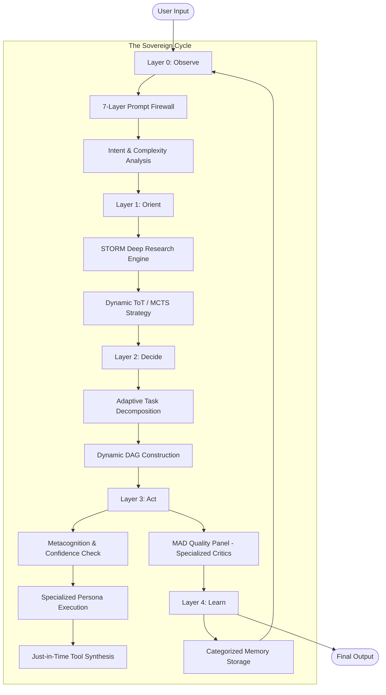

# GAAP Architecture Guide

This document provides a comprehensive overview of GAAP's architecture, including the 4-layer cognitive system, data flow, and component interactions.

## Table of Contents

1. [Overview](#overview)
2. [4-Layer Architecture](#4-layer-architecture)
3. [Layer 0: Interface](#layer-0-interface)
4. [Layer 1: Strategic](#layer-1-strategic)
5. [Layer 2: Tactical](#layer-2-tactical)
6. [Layer 3: Execution](#layer-3-execution)
7. [Supporting Systems](#supporting-systems)
8. [Data Flow](#data-flow)
9. [Design Decisions](#design-decisions)

---

## Overview

GAAP implements a **Sovereign Cognitive Architecture** based on the **OODA Loop** (Observe-Orient-Decide-Act), designed for autonomous problem-solving across multiple domains (Research, Diagnostics, and Software Engineering).



### Core Evolution Principles (v2.1 Sovereign)

1. **Contextual Adaptation**: Strategies, tasks, and agents adapt dynamically to the intent (Research vs. Coding).
2. **Predictive Simulation**: Actions are rehearsed in the GhostFS Holodeck before actual execution.
3. **Recursive Growth**: The system synthesizes its own tools when faced with capability gaps.
4. **Metacognitive Doubt**: Agents monitor their own confidence levels and thoughts in real-time.
5. **Domain-Specific Memory**: Experiences are partitioned by domain to ensure relevant retrieval.

---

## 4-Layer Architecture

### Layer Responsibilities

| Layer | Input | Output | Key Decisions |
|-------|-------|--------|---------------|
| **L0** | Raw text | StructuredIntent | Is this safe? What type? How complex? Where to route? |
| **L1** | StructuredIntent | ArchitectureSpec | What approach? What components? What risks? |
| **L2** | ArchitectureSpec | TaskGraph | What tasks? What order? What dependencies? |
| **L3** | AtomicTask | ExecutionResult | How to execute? Is quality acceptable? |

### Routing Logic

```python
if intent_type in [PLANNING, ANALYSIS] or complexity == ARCHITECTURAL:
    route_to = STRATEGIC  # Layer 1
elif intent_type in [CODE_GENERATION, REFACTORING, TESTING] or complexity in [COMPLEX, MODERATE]:
    route_to = TACTICAL   # Layer 2
else:
    route_to = DIRECT     # Layer 3 directly
```

---

## Layer 0: Interface

**File**: `gaap/layers/layer0_interface.py`

### Purpose
Entry point for all requests - handles security, classification, and routing.

### Components

#### IntentClassifier

Classifies user intent into 11 types using pattern matching:

| Intent Type | Description | Example Patterns |
|-------------|-------------|------------------|
| CODE_GENERATION | Create new code | "write", "implement", "create function" |
| CODE_REVIEW | Review existing code | "review", "check", "audit" |
| DEBUGGING | Fix errors | "debug", "fix", "error", "bug" |
| REFACTORING | Improve code structure | "refactor", "optimize", "clean" |
| DOCUMENTATION | Write docs | "document", "docstring", "readme" |
| TESTING | Write tests | "test", "unit test", "coverage" |
| RESEARCH | Gather information | "research", "find", "search" |
| ANALYSIS | Analyze data/code | "analyze", "evaluate", "assess" |
| PLANNING | Create plans | "plan", "design", "architecture" |
| QUESTION | Simple question | "what", "how", "why" |
| CONVERSATION | General chat | "hello", "thanks", "hi" |

#### RequestParser

Extracts implicit requirements from natural language:

```python
# Example extraction
"Build a fast real-time API" -> {
    "performance": "high_throughput",
    "real_time": True,
    "timeline": "immediate"
}
```

#### ComplexityEstimator

Estimates task complexity based on:

1. **Keywords**: "complex", "simple", "architecture", etc.
2. **Length**: Word count factor
3. **Requirements**: Number of constraints

| Complexity | Description | Typical Tasks |
|------------|-------------|---------------|
| TRIVIAL | Single line | Variable assignment |
| SIMPLE | Single function | One function/method |
| MODERATE | Single component | Module, class |
| COMPLEX | Multiple components | Feature, subsystem |
| ARCHITECTURAL | Full system | New architecture |

### Data Flow

```
Input Text
    |
    v
+----------------+
| Security Scan  | --> Firewall (7 layers)
+----------------+
    |
    v
+----------------+
| Classify Intent| --> IntentType + Confidence
+----------------+
    |
    v
+----------------+
| Parse Request  | --> Implicit Requirements
+----------------+
    |
    v
+----------------+
| Estimate       | --> TaskComplexity
| Complexity     |
+----------------+
    |
    v
+----------------+
| Routing        | --> RoutingTarget
| Decision       |
+----------------+
    |
    v
StructuredIntent
```

---

## Layer 1: Strategic

**File**: `gaap/layers/layer1_strategic.py`

### Purpose
Transforms high-level intents into detailed architectural specifications.

### Components

#### ToTStrategic (Tree of Thoughts)

Explores solution space across 5 levels:

```
Level 0: Architecture Paradigm
    +-- monolith
    +-- microservices
    +-- serverless
    +-- modular_monolith
    
Level 1: Data Strategy
    +-- single_db
    +-- polyglot
    +-- cqrs
    +-- event_sourcing
    
Level 2: Communication Pattern
    +-- rest
    +-- graphql
    +-- grpc
    +-- message_queue
    
Level 3: Infrastructure
    +-- kubernetes
    +-- docker
    +-- serverless
    +-- vm
    
Level 4: Monitoring
    +-- prometheus
    +-- datadog
    +-- cloudwatch
    +-- custom
```

**Algorithm**:
1. Generate options at each level
2. Score options based on requirements
3. Prune low-scoring branches (< 0.3)
4. Select best path through tree

#### MADArchitecturePanel

Multi-Agent Debate with 4 architecture critics:

| Critic | Perspective | Focus |
|--------|-------------|-------|
| **Scalability** | Can it grow? | Load handling, distributed design |
| **Pragmatism** | Is it practical? | Time, resources, team skills |
| **Cost** | Is it affordable? | Infrastructure, maintenance |
| **Robustness** | Is it reliable? | Error handling, resilience |

**Debate Process**:
```
Round 1: Each critic evaluates independently
Round 2: Critics discuss disagreements
Round 3: Final vote for consensus

If consensus >= 0.85: APPROVED
Else: Refine and retry (max 3 rounds)
```

### Output: ArchitectureSpec

```python
@dataclass
class ArchitectureSpec:
    paradigm: ArchitectureParadigm      # monolith, microservices, etc.
    data_strategy: DataStrategy         # single_db, cqrs, etc.
    communication: CommunicationPattern # rest, graphql, etc.
    infrastructure: Infrastructure      # kubernetes, serverless, etc.
    
    components: list[Component]         # System components
    decisions: list[Decision]           # Key decisions with rationale
    risks: list[Risk]                   # Identified risks
    phases: list[Phase]                 # Implementation phases
    
    complexity_score: float             # 0.0 - 1.0
    estimated_time: str                 # "2 weeks", "3 months"
    consensus_reached: bool             # MAD panel result
```

---

## Layer 2: Tactical

**File**: `gaap/layers/layer2_tactical.py`

### Purpose
Decomposes architectural specifications into executable tasks with dependency ordering.

### Components

#### AtomicTask

Self-contained execution unit:

```python
@dataclass
class AtomicTask:
    id: str                    # "task_001"
    name: str                  # "Implement User Auth"
    description: str           # Full description
    category: TaskCategory     # SETUP, DATABASE, API, FRONTEND, TESTING
    type: TaskType             # CODE_GENERATION, DEBUGGING, etc.
    priority: TaskPriority     # CRITICAL, HIGH, NORMAL, LOW
    complexity: TaskComplexity # TRIVIAL to ARCHITECTURAL
    
    dependencies: list[str]           # Task IDs this depends on
    acceptance_criteria: list[str]     # Success conditions
    constraints: dict[str, Any]       # Resource/time limits
    
    estimated_tokens: int      # Token estimate
    estimated_time_minutes: int
    estimated_cost_usd: float
```

#### TaskGraph (DAG)

Directed Acyclic Graph for task ordering:

```python
class TaskGraph:
    def get_ready_tasks(self, completed, in_progress) -> list[AtomicTask]:
        """Returns tasks whose dependencies are all completed."""
        
    def detect_cycles(self) -> list[list[str]]:
        """Detects and returns any cycles in the graph."""
        
    def find_critical_path(self) -> list[str]:
        """Finds longest path (approximate)."""
```

**Cycle Detection**: DFS-based algorithm that identifies back edges.

**Critical Path**: Approximate calculation using node depth (not actual duration).

#### TacticalDecomposer

Primary: LLM-powered decomposition with robust JSON parsing:

```python
# Prompt includes:
# 1. Original user request
# 2. Architecture context
# 3. Output format specification

# Fallback: Heuristic decomposition by intent type
if intent_type == 'CODE_GENERATION':
    tasks = [
        AnalyzeTask,
        ImplementTask,
        TestTask
    ]
elif intent_type == 'DEBUGGING':
    tasks = [
        ReproduceTask,
        DiagnoseTask,
        FixTask,
        VerifyTask
    ]
```

### Task Categories

| Category | Description | Typical Tasks |
|----------|-------------|---------------|
| SETUP | Project initialization | Config, dependencies, structure |
| DATABASE | Data layer | Schema, migrations, queries |
| API | Backend logic | Endpoints, services, auth |
| FRONTEND | UI layer | Components, pages, styling |
| TESTING | Quality assurance | Unit tests, integration tests |
| DOCUMENTATION | Docs | README, API docs, comments |
| INFRASTRUCTURE | DevOps | Docker, CI/CD, deployment |

---

## Layer 3: Execution

**File**: `gaap/layers/layer3_execution.py`

### Purpose
Executes atomic tasks with quality assurance and verification.

### Components

#### GeneticTwin

Parallel execution verification for critical tasks:

```
+------------------+     +------------------+
| Primary Exec     |     | Twin Exec        |
| temp=0.7         |     | temp=0.3         |
+------------------+     +------------------+
         |                        |
         v                        v
    Result A                 Result B
         |                        |
         +--------+---------------+
                  |
                  v
         Similarity Check (Jaccard)
                  |
                  v
         Agreement >= 0.95? --> ACCEPT
         Agreement < 0.95?  --> WARNING
```

**Use Cases**:
- Critical tasks (CRITICAL/HIGH priority)
- High-stakes decisions
- Security-sensitive operations

#### MADQualityPanel

Multi-critic quality evaluation with 6 critic types:

| Critic | Weight | Focus |
|--------|--------|-------|
| **Logic** | 0.35 | Correctness, edge cases, error handling |
| **Security** | 0.25 | Vulnerabilities, injection, auth |
| **Performance** | 0.20 | Efficiency, complexity, optimization |
| **Style** | 0.10 | Naming, structure, readability |
| **Compliance** | 0.05 | Standards, regulations, policies |
| **Ethics** | 0.05 | Bias, fairness, impact |

**Approval Logic**:
```python
final_score = sum(critic_score * weight for each critic)

if final_score >= 70.0:
    if is_critical and unanimous_required:
        return all(critic.approved for critic in critics)
    return True
return False
```

#### ExecutorPool

Manages parallel task execution:

```python
class ExecutorPool:
    max_parallel: int = 10
    
    async def execute(self, task: AtomicTask) -> ExecutionResult:
        # 1. Prepare messages
        # 2. Route to provider
        # 3. Execute with fallback
        # 4. Handle tool calls
        # 5. Return result
```

**Tool Execution**:
```
LLM Output: "CALL: search_files(pattern='*.py')"
    |
    v
Tool Registry executes search_files
    |
    v
Result fed back to LLM for next iteration
```

### Output: ExecutionResult

```python
@dataclass
class ExecutionResult:
    task_id: str
    success: bool
    output: Any | None
    error: str | None
    
    quality_score: float        # 0-100
    tokens_used: int
    cost_usd: float
    latency_ms: float
    
    critic_evaluations: list[CriticEvaluation]
    healing_level: str | None
    retries: int
```

---

## Supporting Systems

### Self-Healing System

**File**: `gaap/healing/healer.py`

5-level recovery hierarchy:

```
L1: RETRY           (max 1 attempt)
    Simple retry for transient errors
    |--> network issues, rate limits
    
L2: REFINE          (max 1 attempt)
    Improve the prompt
    |--> syntax errors, validation failures
    
L3: PIVOT           (max 1 attempt)
    Change the model/provider
    |--> model limits, capability issues
    
L4: STRATEGY_SHIFT  (max 1 attempt)
    Simplify the task
    |--> complex failures, timeouts
    
L5: HUMAN_ESCALATE  (no auto-retry)
    Require human intervention
    |--> security violations, critical errors
```

**Error Classification**:

| Category | Start Level | Examples |
|----------|-------------|----------|
| TRANSIENT | L1_RETRY | Network, rate limits |
| SYNTAX | L2_REFINE | Parse errors, invalid output |
| LOGIC | L2_REFINE | Validation failures |
| MODEL_LIMIT | L3_PIVOT | Context exceeded, timeout |
| RESOURCE | L3_PIVOT | Budget exceeded, quota |
| CRITICAL | L5_HUMAN | Security violations |

### Hierarchical Memory

**File**: `gaap/memory/hierarchical.py`

4-tier memory system:

```
+-------------------+
| L1: Working       |  100 items, fast access, current context
+-------------------+
         |
         v (promotion after 3 accesses)
+-------------------+
| L2: Episodic      |  Event history, success/failure records
+-------------------+
         |
         v (pattern extraction)
+-------------------+
| L3: Semantic      |  Rules and patterns, "X implies Y"
+-------------------+
         |
         v (skill crystallization)
+-------------------+
| L4: Procedural    |  Templates and procedures, "how-to"
+-------------------+
```

**Memory Decay**:
```python
strength = importance + (access_count * 0.1) - (decay_rate * age_hours)
```

### Security System

**File**: `gaap/security/firewall.py`

7-layer defense:

| Layer | Name | Detection Method |
|-------|------|------------------|
| L1 | Surface | Pattern matching for known attacks |
| L2 | Lexical | Obfuscation detection (hex, unicode) |
| L3 | Syntactic | Nested instructions, suspicious comments |
| L4 | Semantic | Danger keywords, context mismatch |
| L5 | Contextual | Role-based verification |
| L6 | Behavioral | Usage pattern analysis |
| L7 | Adversarial | Active testing |

**Attack Types Detected**:
- Prompt Injection
- Jailbreak attempts (DAN mode, developer mode)
- Data Exfiltration
- Code Injection
- Role Confusion
- Context Manipulation

---

## Data Flow

### Complete Request Flow

```
1. USER INPUT
   "Build a REST API for user management"
        |
        v
2. LAYER 0: INTERFACE
   + Security Scan: SAFE
   + Intent: CODE_GENERATION
   + Complexity: MODERATE
   + Route: TACTICAL
        |
        v
3. LAYER 1: STRATEGIC (skipped for TACTICAL route)
        |
        v
4. LAYER 2: TACTICAL
   Tasks:
   [1] Setup project structure
   [2] Design database schema
   [3] Implement user model
   [4] Create auth endpoints
   [5] Write tests
   Dependencies: 1->2->3->4->5
        |
        v
5. LAYER 3: EXECUTION
   Task 1: Setup -> SUCCESS (quality: 85)
   Task 2: Schema -> SUCCESS (quality: 92)
   Task 3: Model -> SUCCESS (quality: 88)
   Task 4: Auth -> SUCCESS (quality: 90)
   Task 5: Tests -> SUCCESS (quality: 95)
        |
        v
6. AGGREGATE OUTPUT
   + Combined results
   + Total cost: $0.023
   + Total time: 45 seconds
   + Overall quality: 90
```

---

## Design Decisions

### Why 4 Layers?

1. **Separation of Concerns**: Each layer has a single responsibility
2. **Progressive Refinement**: From vague to concrete
3. **Efficiency**: Simple tasks skip complex layers
4. **Debuggability**: Clear checkpoints for troubleshooting

### Why Regex for Intent Classification?

- **Speed**: Sub-millisecond classification
- **Transparency**: Easy to understand and debug
- **Maintainability**: Simple to add new patterns
- **Future**: Can be upgraded to embeddings without changing interface

### Why Jaccard for Twin Similarity?

- **Simplicity**: No external dependencies
- **Speed**: Fast calculation
- **Limitation**: Acknowledged - semantic similarity would be better
- **Future**: Planned upgrade to embedding-based similarity

### Why Singleton ConfigManager?

- **Consistency**: Single source of truth
- **Performance**: No repeated file reads
- **Thread Safety**: Lock-protected access
- **Hot Reload**: Supports configuration updates

---

## Extension Points

### Adding a New Layer

```python
class Layer4MetaLearning(BaseLayer):
    def __init__(self, config: MetaLearningConfig):
        self.config = config
        
    async def process(self, input_data: Any) -> Any:
        # Learn from execution patterns
        # Update routing weights
        # Extract knowledge
        pass
```

### Adding a New Critic

```python
class AccessibilityCritic(Critic):
    type = CriticType.ACCESSIBILITY
    weight = 0.10
    
    async def evaluate(self, artifact: str, task: Task) -> CriticEvaluation:
        # Check for accessibility issues
        return CriticEvaluation(
            score=85.0,
            approved=True,
            issues=[],
            suggestions=["Add alt text to images"]
        )
```

### Adding a New Provider

```python
class MyProvider(BaseProvider):
    async def chat_completion(
        self,
        messages: list[Message],
        model: str,
        **kwargs
    ) -> ChatCompletionResponse:
        # Implement provider-specific logic
        pass
```

---

## Performance Characteristics

| Operation | Typical Latency | Notes |
|-----------|-----------------|-------|
| L0 Classification | < 10ms | Pure Python, no LLM |
| L1 Architecture | 5-30s | Depends on ToT depth |
| L2 Decomposition | 3-15s | LLM-powered |
| L3 Execution | 1-60s | Per task, depends on provider |
| Security Scan | < 50ms | 7 layers of pattern matching |
| Memory Retrieve | < 1ms | In-memory hash lookup |

---

## Next Steps

- [API Reference](API_REFERENCE.md) - Detailed API documentation
- [Providers Guide](PROVIDERS.md) - Provider setup and configuration
- [Security Guide](SECURITY.md) - Security best practices