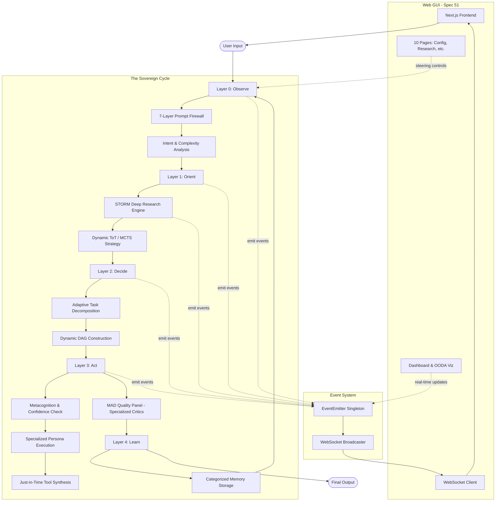

# GAAP Architecture Guide

This document provides a comprehensive overview of GAAP's architecture, including the 4-layer cognitive system, data flow, and component interactions.

## Table of Contents

1. [Overview](#overview)
2. [4-Layer Architecture](#4-layer-architecture)
3. [Layer 0: Interface](#layer-0-interface)
4. [Layer 1: Strategic](#layer-1-strategic)
5. [Layer 2: Tactical](#layer-2-tactical)
6. [Layer 3: Execution](#layer-3-execution)
7. [Supporting Systems](#supporting-systems)
8. [Research System](#research-system-deep-discovery-engine)
9. [MCTS Planning](#mcts-planning)
10. [Swarm Intelligence](#swarm-intelligence)
11. [Meta-Learning](#meta-learning)
12. [Technical Debt Agent](#technical-debt-agent)
13. [Knowledge Ingestion](#knowledge-ingestion)
14. [Web Interface (Spec 51)](#web-interface-spec-51)
15. [Event System](#event-system)
16. [Frontend Architecture](#frontend-architecture)
17. [Data Flow](#data-flow)
18. [Design Decisions](#design-decisions)

---

## Overview

GAAP implements a **Sovereign Cognitive Architecture** based on the **OODA Loop** (Observe-Orient-Decide-Act), designed for autonomous problem-solving across multiple domains (Research, Diagnostics, and Software Engineering).



### Core Evolution Principles (v2.1 Sovereign)

1. **Contextual Adaptation**: Strategies, tasks, and agents adapt dynamically to the intent (Research vs. Coding).
2. **Predictive Simulation**: Actions are rehearsed in the GhostFS Holodeck before actual execution.
3. **Recursive Growth**: The system synthesizes its own tools when faced with capability gaps.
4. **Metacognitive Doubt**: Agents monitor their own confidence levels and thoughts in real-time.
5. **Domain-Specific Memory**: Experiences are partitioned by domain to ensure relevant retrieval.

---

## 4-Layer Architecture

### Layer Responsibilities

| Layer | Input | Output | Key Decisions |
|-------|-------|--------|---------------|
| **L0** | Raw text | StructuredIntent | Is this safe? What type? How complex? Where to route? |
| **L1** | StructuredIntent | ArchitectureSpec | What approach? What components? What risks? |
| **L2** | ArchitectureSpec | TaskGraph | What tasks? What order? What dependencies? |
| **L3** | AtomicTask | ExecutionResult | How to execute? Is quality acceptable? |

### Routing Logic

```python
if intent_type in [PLANNING, ANALYSIS] or complexity == ARCHITECTURAL:
    route_to = STRATEGIC  # Layer 1
elif intent_type in [CODE_GENERATION, REFACTORING, TESTING] or complexity in [COMPLEX, MODERATE]:
    route_to = TACTICAL   # Layer 2
else:
    route_to = DIRECT     # Layer 3 directly
```

---

## Layer 0: Interface

**File**: `gaap/layers/layer0_interface.py`

### Purpose
Entry point for all requests - handles security, classification, and routing.

### Components

#### IntentClassifier

Classifies user intent into 11 types using pattern matching:

| Intent Type | Description | Example Patterns |
|-------------|-------------|------------------|
| CODE_GENERATION | Create new code | "write", "implement", "create function" |
| CODE_REVIEW | Review existing code | "review", "check", "audit" |
| DEBUGGING | Fix errors | "debug", "fix", "error", "bug" |
| REFACTORING | Improve code structure | "refactor", "optimize", "clean" |
| DOCUMENTATION | Write docs | "document", "docstring", "readme" |
| TESTING | Write tests | "test", "unit test", "coverage" |
| RESEARCH | Gather information | "research", "find", "search" |
| ANALYSIS | Analyze data/code | "analyze", "evaluate", "assess" |
| PLANNING | Create plans | "plan", "design", "architecture" |
| QUESTION | Simple question | "what", "how", "why" |
| CONVERSATION | General chat | "hello", "thanks", "hi" |

#### RequestParser

Extracts implicit requirements from natural language:

```python
# Example extraction
"Build a fast real-time API" -> {
    "performance": "high_throughput",
    "real_time": True,
    "timeline": "immediate"
}
```

#### ComplexityEstimator

Estimates task complexity based on:

1. **Keywords**: "complex", "simple", "architecture", etc.
2. **Length**: Word count factor
3. **Requirements**: Number of constraints

| Complexity | Description | Typical Tasks |
|------------|-------------|---------------|
| TRIVIAL | Single line | Variable assignment |
| SIMPLE | Single function | One function/method |
| MODERATE | Single component | Module, class |
| COMPLEX | Multiple components | Feature, subsystem |
| ARCHITECTURAL | Full system | New architecture |

### Data Flow

```
Input Text
    |
    v
+----------------+
| Security Scan  | --> Firewall (7 layers)
+----------------+
    |
    v
+----------------+
| Classify Intent| --> IntentType + Confidence
+----------------+
    |
    v
+----------------+
| Parse Request  | --> Implicit Requirements
+----------------+
    |
    v
+----------------+
| Estimate       | --> TaskComplexity
| Complexity     |
+----------------+
    |
    v
+----------------+
| Routing        | --> RoutingTarget
| Decision       |
+----------------+
    |
    v
StructuredIntent
```

---

## Layer 1: Strategic

**File**: `gaap/layers/layer1_strategic.py`

### Purpose
Transforms high-level intents into detailed architectural specifications.

### Components

#### ToTStrategic (Tree of Thoughts)

Explores solution space across 5 levels:

```
Level 0: Architecture Paradigm
    +-- monolith
    +-- microservices
    +-- serverless
    +-- modular_monolith
    
Level 1: Data Strategy
    +-- single_db
    +-- polyglot
    +-- cqrs
    +-- event_sourcing
    
Level 2: Communication Pattern
    +-- rest
    +-- graphql
    +-- grpc
    +-- message_queue
    
Level 3: Infrastructure
    +-- kubernetes
    +-- docker
    +-- serverless
    +-- vm
    
Level 4: Monitoring
    +-- prometheus
    +-- datadog
    +-- cloudwatch
    +-- custom
```

**Algorithm**:
1. Generate options at each level
2. Score options based on requirements
3. Prune low-scoring branches (< 0.3)
4. Select best path through tree

#### MADArchitecturePanel

Multi-Agent Debate with 4 architecture critics:

| Critic | Perspective | Focus |
|--------|-------------|-------|
| **Scalability** | Can it grow? | Load handling, distributed design |
| **Pragmatism** | Is it practical? | Time, resources, team skills |
| **Cost** | Is it affordable? | Infrastructure, maintenance |
| **Robustness** | Is it reliable? | Error handling, resilience |

**Debate Process**:
```
Round 1: Each critic evaluates independently
Round 2: Critics discuss disagreements
Round 3: Final vote for consensus

If consensus >= 0.85: APPROVED
Else: Refine and retry (max 3 rounds)
```

### Output: ArchitectureSpec

```python
@dataclass
class ArchitectureSpec:
    paradigm: ArchitectureParadigm      # monolith, microservices, etc.
    data_strategy: DataStrategy         # single_db, cqrs, etc.
    communication: CommunicationPattern # rest, graphql, etc.
    infrastructure: Infrastructure      # kubernetes, serverless, etc.
    
    components: list[Component]         # System components
    decisions: list[Decision]           # Key decisions with rationale
    risks: list[Risk]                   # Identified risks
    phases: list[Phase]                 # Implementation phases
    
    complexity_score: float             # 0.0 - 1.0
    estimated_time: str                 # "2 weeks", "3 months"
    consensus_reached: bool             # MAD panel result
```

---

## Layer 2: Tactical

**File**: `gaap/layers/layer2_tactical.py`

### Purpose
Decomposes architectural specifications into executable tasks with dependency ordering.

### Components

#### AtomicTask

Self-contained execution unit:

```python
@dataclass
class AtomicTask:
    id: str                    # "task_001"
    name: str                  # "Implement User Auth"
    description: str           # Full description
    category: TaskCategory     # SETUP, DATABASE, API, FRONTEND, TESTING
    type: TaskType             # CODE_GENERATION, DEBUGGING, etc.
    priority: TaskPriority     # CRITICAL, HIGH, NORMAL, LOW
    complexity: TaskComplexity # TRIVIAL to ARCHITECTURAL
    
    dependencies: list[str]           # Task IDs this depends on
    acceptance_criteria: list[str]     # Success conditions
    constraints: dict[str, Any]       # Resource/time limits
    
    estimated_tokens: int      # Token estimate
    estimated_time_minutes: int
    estimated_cost_usd: float
```

#### TaskGraph (DAG)

Directed Acyclic Graph for task ordering:

```python
class TaskGraph:
    def get_ready_tasks(self, completed, in_progress) -> list[AtomicTask]:
        """Returns tasks whose dependencies are all completed."""
        
    def detect_cycles(self) -> list[list[str]]:
        """Detects and returns any cycles in the graph."""
        
    def find_critical_path(self) -> list[str]:
        """Finds longest path (approximate)."""
```

**Cycle Detection**: DFS-based algorithm that identifies back edges.

**Critical Path**: Approximate calculation using node depth (not actual duration).

#### TacticalDecomposer

Primary: LLM-powered decomposition with robust JSON parsing:

```python
# Prompt includes:
# 1. Original user request
# 2. Architecture context
# 3. Output format specification

# Fallback: Heuristic decomposition by intent type
if intent_type == 'CODE_GENERATION':
    tasks = [
        AnalyzeTask,
        ImplementTask,
        TestTask
    ]
elif intent_type == 'DEBUGGING':
    tasks = [
        ReproduceTask,
        DiagnoseTask,
        FixTask,
        VerifyTask
    ]
```

### Task Categories

| Category | Description | Typical Tasks |
|----------|-------------|---------------|
| SETUP | Project initialization | Config, dependencies, structure |
| DATABASE | Data layer | Schema, migrations, queries |
| API | Backend logic | Endpoints, services, auth |
| FRONTEND | UI layer | Components, pages, styling |
| TESTING | Quality assurance | Unit tests, integration tests |
| DOCUMENTATION | Docs | README, API docs, comments |
| INFRASTRUCTURE | DevOps | Docker, CI/CD, deployment |

---

## Layer 3: Execution

**File**: `gaap/layers/layer3_execution.py`

### Purpose
Executes atomic tasks with quality assurance and verification.

### Components

#### GeneticTwin

Parallel execution verification for critical tasks:

```
+------------------+     +------------------+
| Primary Exec     |     | Twin Exec        |
| temp=0.7         |     | temp=0.3         |
+------------------+     +------------------+
         |                        |
         v                        v
    Result A                 Result B
         |                        |
         +--------+---------------+
                  |
                  v
         Similarity Check (Jaccard)
                  |
                  v
         Agreement >= 0.95? --> ACCEPT
         Agreement < 0.95?  --> WARNING
```

**Use Cases**:
- Critical tasks (CRITICAL/HIGH priority)
- High-stakes decisions
- Security-sensitive operations

#### MADQualityPanel

Multi-critic quality evaluation with 6 critic types:

| Critic | Weight | Focus |
|--------|--------|-------|
| **Logic** | 0.35 | Correctness, edge cases, error handling |
| **Security** | 0.25 | Vulnerabilities, injection, auth |
| **Performance** | 0.20 | Efficiency, complexity, optimization |
| **Style** | 0.10 | Naming, structure, readability |
| **Compliance** | 0.05 | Standards, regulations, policies |
| **Ethics** | 0.05 | Bias, fairness, impact |

**Approval Logic**:
```python
final_score = sum(critic_score * weight for each critic)

if final_score >= 70.0:
    if is_critical and unanimous_required:
        return all(critic.approved for critic in critics)
    return True
return False
```

#### ExecutorPool

Manages parallel task execution:

```python
class ExecutorPool:
    max_parallel: int = 10
    
    async def execute(self, task: AtomicTask) -> ExecutionResult:
        # 1. Prepare messages
        # 2. Route to provider
        # 3. Execute with fallback
        # 4. Handle tool calls
        # 5. Return result
```

**Tool Execution**:
```
LLM Output: "CALL: search_files(pattern='*.py')"
    |
    v
Tool Registry executes search_files
    |
    v
Result fed back to LLM for next iteration
```

### Output: ExecutionResult

```python
@dataclass
class ExecutionResult:
    task_id: str
    success: bool
    output: Any | None
    error: str | None
    
    quality_score: float        # 0-100
    tokens_used: int
    cost_usd: float
    latency_ms: float
    
    critic_evaluations: list[CriticEvaluation]
    healing_level: str | None
    retries: int
```

---

## Supporting Systems

### Self-Healing System

**File**: `gaap/healing/healer.py`

5-level recovery hierarchy:

```
L1: RETRY           (max 1 attempt)
    Simple retry for transient errors
    |--> network issues, rate limits
    
L2: REFINE          (max 1 attempt)
    Improve the prompt
    |--> syntax errors, validation failures
    
L3: PIVOT           (max 1 attempt)
    Change the model/provider
    |--> model limits, capability issues
    
L4: STRATEGY_SHIFT  (max 1 attempt)
    Simplify the task
    |--> complex failures, timeouts
    
L5: HUMAN_ESCALATE  (no auto-retry)
    Require human intervention
    |--> security violations, critical errors
```

**Error Classification**:

| Category | Start Level | Examples |
|----------|-------------|----------|
| TRANSIENT | L1_RETRY | Network, rate limits |
| SYNTAX | L2_REFINE | Parse errors, invalid output |
| LOGIC | L2_REFINE | Validation failures |
| MODEL_LIMIT | L3_PIVOT | Context exceeded, timeout |
| RESOURCE | L3_PIVOT | Budget exceeded, quota |
| CRITICAL | L5_HUMAN | Security violations |

### Hierarchical Memory

**File**: `gaap/memory/hierarchical.py`

4-tier memory system:

```
+-------------------+
| L1: Working       |  100 items, fast access, current context
+-------------------+
         |
         v (promotion after 3 accesses)
+-------------------+
| L2: Episodic      |  Event history, success/failure records
+-------------------+
         |
         v (pattern extraction)
+-------------------+
| L3: Semantic      |  Rules and patterns, "X implies Y"
+-------------------+
         |
         v (skill crystallization)
+-------------------+
| L4: Procedural    |  Templates and procedures, "how-to"
+-------------------+
```

**Memory Decay**:
```python
strength = importance + (access_count * 0.1) - (decay_rate * age_hours)
```

### Security System

**File**: `gaap/security/firewall.py`

7-layer defense:

| Layer | Name | Detection Method |
|-------|------|------------------|
| L1 | Surface | Pattern matching for known attacks |
| L2 | Lexical | Obfuscation detection (hex, unicode) |
| L3 | Syntactic | Nested instructions, suspicious comments |
| L4 | Semantic | Danger keywords, context mismatch |
| L5 | Contextual | Role-based verification |
| L6 | Behavioral | Usage pattern analysis |
| L7 | Adversarial | Active testing |

**Attack Types Detected**:
- Prompt Injection
- Jailbreak attempts (DAN mode, developer mode)
- Data Exfiltration
- Code Injection
- Role Confusion
- Context Manipulation

### Research System (Deep Discovery Engine)

**File**: `gaap/research/`

The Deep Discovery Engine (DDE) is an inference-first research system integrated into the OODA loop. It provides autonomous research capabilities for gathering, verifying, and synthesizing information.

#### Architecture

```
┌─────────────────────────────────────────────────────────────────┐
│                    DeepDiscoveryEngine                          │
│                     (Main Orchestrator)                         │
└─────────────────────────────────────────────────────────────────┘
                              │
         ┌────────────────────┼────────────────────┐
         │                    │                    │
         ▼                    ▼                    ▼
┌─────────────┐    ┌─────────────────┐    ┌─────────────────┐
│ WebFetcher  │───▶│  SourceAuditor  │───▶│ContentExtractor │
│  (Search)   │    │   (ETS Scoring) │    │  (Clean Text)   │
└─────────────┘    └─────────────────┘    └─────────────────┘
                              │
                              ▼
                   ┌─────────────────────┐
                   │      DeepDive       │
                   │(Citation Mapping +  │
                   │ Cross-Validation)   │
                   └─────────────────────┘
                              │
         ┌────────────────────┼────────────────────┐
         │                    │                    │
         ▼                    ▼                    ▼
┌─────────────┐    ┌─────────────────┐    ┌─────────────────┐
│ Synthesizer │───▶│   Hypothesis    │───▶│  Associative    │
│    (LLM)    │    │  Verification   │    │    Triples      │
└─────────────┘    └─────────────────┘    └─────────────────┘
                              │
                              ▼
                   ┌─────────────────────┐
                   │KnowledgeIntegrator  │
                   │  (Permanent Store)  │
                   └─────────────────────┘
```

#### Components

| Component | File | Purpose |
|-----------|------|---------|
| **DeepDiscoveryEngine** | `engine.py` | Main orchestrator |
| **WebFetcher** | `web_fetcher.py` | Multi-provider web search |
| **SourceAuditor** | `source_auditor.py` | ETS scoring and filtering |
| **ContentExtractor** | `content_extractor.py` | Clean text extraction |
| **Synthesizer** | `synthesizer.py` | LLM-powered hypothesis building |
| **DeepDive** | `deep_dive.py` | Citation mapping, cross-validation |
| **KnowledgeIntegrator** | `knowledge_integrator.py` | Permanent storage |

#### Research Depth Levels

| Depth | Description | Actions |
|-------|-------------|---------|
| 1 | Basic | Web search + content extraction |
| 2 | Standard | + Citation following |
| 3 | Deep | + Cross-validation + hypothesis building |
| 4 | Extended | + Related topic exploration |
| 5 | Full | + Recursive exploration |

#### Epistemic Trust Score (ETS)

Sources are scored on credibility (0.0-1.0):

| Level | Score | Source Types |
|-------|-------|--------------|
| VERIFIED | 1.0 | Official docs, verified repos |
| RELIABLE | 0.7 | Peer-reviewed papers, high-reputation SO |
| QUESTIONABLE | 0.5 | Medium articles, tutorials |
| UNRELIABLE | 0.3 | Random blogs, AI summaries |
| BLACKLISTED | 0.0 | Contradictory or banned domains |

#### Integration with OODA Loop

```
Layer 1 (Orient) ────────────────────────────────────────────────┐
    │                                                            │
    ├── IntentClassifier detects RESEARCH intent                │
    │                                                            │
    └──▶ DeepDiscoveryEngine.research(query)                    │
           │                                                     │
           ├── Web search for sources                            │
           ├── ETS scoring and filtering                         │
           ├── Content extraction                                │
           ├── Citation mapping (depth >= 2)                     │
           ├── Cross-validation (depth >= 3)                     │
           ├── Hypothesis building and verification              │
           └── Knowledge graph storage                            │
                     │                                           │
                     ▼                                           │
           ResearchResult ───────────────────────────────────────┘
                     │
                     ▼
Layer 2 (Decide) uses research findings for planning
```

#### Usage

```python
from gaap.research import DeepDiscoveryEngine, DDEConfig

# Configure research depth
config = DDEConfig(
    research_depth=3,  # Standard depth
    max_total_sources=50,
)

engine = DeepDiscoveryEngine(config=config, llm_provider=provider)

# Execute research
result = await engine.research("FastAPI async best practices")

if result.success:
    print(f"Sources: {len(result.finding.sources)}")
    print(f"Hypotheses: {len(result.finding.hypotheses)}")
    print(f"Avg ETS: {result.metrics.avg_ets_score:.2f}")
```

---

## MCTS Planning

**File**: `gaap/layers/mcts_logic.py` (834 lines)

Monte Carlo Tree Search extends Tree of Thoughts with simulation and value estimation to find the globally optimal decision path.

### Overview

MCTS provides strategic planning with probabilistic outcome estimation:

```
┌─────────────────────────────────────────────────────────────────┐
│                      MCTS Search Process                         │
├─────────────────────────────────────────────────────────────────┤
│                                                                  │
│  1. SELECTION                                                    │
│     └── UCT formula: UCB1 = Q/N + c * sqrt(ln(N_parent) / N)    │
│                                                                  │
│  2. EXPANSION                                                    │
│     └── Generate child nodes (decision options)                  │
│                                                                  │
│  3. SIMULATION                                                   │
│     └── Rollout to estimate outcome value                        │
│                                                                  │
│  4. BACKPROPAGATION                                              │
│     └── Update node statistics up the tree                       │
│                                                                  │
└─────────────────────────────────────────────────────────────────┘
```

### Configuration

```python
@dataclass
class MCTSConfig:
    iterations: int = 50           # For CRITICAL priority
    exploration_weight: float = 1.414  # UCT parameter
    expansion_factor: int = 3      # Children per expansion
    max_depth: int = 5             # Maximum tree depth
    rollout_depth: int = 5         # Simulation depth
    parallel_rollouts: bool = True
```

### Priority-Based Iterations

| Priority | Iterations | Use Case |
|----------|------------|----------|
| CRITICAL | 50 | No catastrophic failure branches missed |
| HIGH | 30 | Important decisions |
| NORMAL | 20 | Standard tasks |
| LOW | 10 | Background tasks |

### Components

| Component | Purpose |
|-----------|---------|
| **MCTSNode** | Search tree node with state, visits, value |
| **MCTSConfig** | Configurable search parameters |
| **ValueOracle** | Success probability predictor |
| **MCTSStrategic** | Main MCTS implementation |

### Usage

```python
from gaap.layers.mcts_logic import MCTSStrategic, MCTSConfig

config = MCTSConfig.for_priority(TaskPriority.CRITICAL)
mcts = MCTSStrategic(config, provider=provider)
best_path = await mcts.search(intent, context)
```

---

## Swarm Intelligence

**Directory**: `gaap/swarm/` (7 files, ~3,350 lines)

Distributed agent coordination system for task delegation and execution.

### Architecture

```
┌─────────────────────────────────────────────────────────────────┐
│                    SwarmOrchestrator                             │
│  ┌─────────────┐  ┌─────────────┐  ┌─────────────┐             │
│  │  Registry   │  │  Auctioneer │  │   Monitor   │             │
│  │  (Fractals) │  │  (Auctions) │  │  (Health)   │             │
│  └─────────────┘  └─────────────┘  └─────────────┘             │
│         │                │                │                     │
│  ┌──────────────────────────────────────────────────────────┐  │
│  │                    Guild Manager                          │  │
│  │   [Python Guild]  [SQL Guild]  [Security Guild]          │  │
│  └──────────────────────────────────────────────────────────┘  │
└─────────────────────────────────────────────────────────────────┘
```

### Components

| Component | File | Lines | Purpose |
|-----------|------|-------|---------|
| **Orchestrator** | `orchestrator.py` | 519 | Central coordinator, auction management |
| **Fractal** | `fractal.py` | 574 | Individual agent with specialization |
| **GISP Protocol** | `gisp_protocol.py` | 547 | Agent communication protocol |
| **Reputation** | `reputation.py` | 558 | Trust and performance tracking |
| **Auction** | `auction.py` | 547 | Task bidding and award system |
| **Guild** | `guild.py` | 492 | Specialist agent groups |

### Task Flow

```
1. Task received from Layer 2
2. Broadcast auction to eligible Fractals
3. Collect bids (based on utility, reputation, capacity)
4. Award task to highest utility bid
5. Monitor execution
6. Update reputations
7. Form Guilds when thresholds met
```

### GISP Protocol

The Generic Inter-Swarm Protocol enables agent communication:

```python
class MessageType(Enum):
    TASK_AUCTION = "task_auction"
    TASK_BID = "task_bid"
    TASK_AWARD = "task_award"
    TASK_RESULT = "task_result"
    HEARTBEAT = "heartbeat"
    CAPABILITY_UPDATE = "capability_update"
```

### Reputation System

```python
@dataclass
class ReputationScore:
    base_score: float = 0.5        # Starting reputation
    task_successes: int = 0
    task_failures: int = 0
    avg_quality: float = 0.0
    specializations: list[str] = field(default_factory=list)
    
    @property
    def effective_score(self) -> float:
        # Decays over time, boosted by successes
        return self.base_score * (1 + self.task_successes * 0.1)
```

---

## Meta-Learning

**Directory**: `gaap/meta_learning/` (6 files, ~2,850 lines)

Recursive self-improvement system that learns from successes and failures.

### Architecture

```
┌─────────────────────────────────────────────────────────────────┐
│                       MetaLearner                                │
│                    (Dream Cycle Coordinator)                     │
├─────────────────────────────────────────────────────────────────┤
│                                                                  │
│  ┌─────────────────┐  ┌─────────────────┐  ┌─────────────────┐ │
│  │ WisdomDistiller │  │  FailureStore   │  │  AxiomBridge    │ │
│  │ (752 lines)     │  │  (596 lines)    │  │  (516 lines)    │ │
│  │                 │  │                 │  │                 │ │
│  │ Success → Rules │  │ Failures → Fix  │  │ Propose Laws    │ │
│  └─────────────────┘  └─────────────────┘  └─────────────────┘ │
│           │                   │                   │             │
│           └───────────────────┼───────────────────┘             │
│                               ▼                                 │
│                    ┌─────────────────────┐                      │
│                    │ ConfidenceCalculator│                      │
│                    │   (403 lines)       │                      │
│                    │                     │                      │
│                    │ Decision Quality    │                      │
│                    └─────────────────────┘                      │
│                                                                  │
└─────────────────────────────────────────────────────────────────┘
```

### Components

| Component | File | Lines | Purpose |
|-----------|------|-------|---------|
| **MetaLearner** | `meta_learner.py` | 527 | Dream cycle coordinator |
| **WisdomDistiller** | `wisdom_distiller.py` | 752 | Extract principles from successes |
| **FailureStore** | `failure_store.py` | 596 | Learn from mistakes |
| **AxiomBridge** | `axiom_bridge.py` | 516 | Propose constitutional rules |
| **ConfidenceCalculator** | `confidence.py` | 403 | Monitor decision quality |

### Dream Cycle

```python
@dataclass
class DreamCycleResult:
    started_at: datetime
    completed_at: datetime | None
    episodes_analyzed: int = 0
    heuristics_distilled: int = 0
    failures_analyzed: int = 0
    axioms_proposed: int = 0
    axioms_committed: int = 0
    new_heuristics: list[ProjectHeuristic] = field(default_factory=list)
    new_proposals: list[AxiomProposal] = field(default_factory=list)
```

### Wisdom Distillation

Extract reusable heuristics from successful executions:

```python
@dataclass
class ProjectHeuristic:
    name: str
    description: str
    domain: str                    # "code_generation", "debugging", etc.
    conditions: list[str]          # When to apply
    actions: list[str]             # What to do
    success_rate: float            # Historical effectiveness
    sample_size: int               # Number of episodes analyzed
```

### Axiom Proposals

System can propose new constitutional rules:

```python
class ProposalStatus(Enum):
    DRAFT = "draft"
    PENDING_REVIEW = "pending_review"
    APPROVED = "approved"
    REJECTED = "rejected"
    COMMITTED = "committed"

@dataclass
class AxiomProposal:
    proposal_id: str
    name: str
    description: str
    rationale: str
    supporting_evidence: list[str]
    status: ProposalStatus = ProposalStatus.DRAFT
```

### Usage

```python
learner = MetaLearner(
    episodic_store=episodic,
    axiom_validator=validator
)

# Run dream cycle
result = await learner.run_dream_cycle()

# Get heuristics for a task
wisdom = learner.get_wisdom_for_task("code generation")
```

---

## Technical Debt Agent

**Directory**: `gaap/maintenance/` (5 files, ~1,730 lines)

Automated technical debt detection, tracking, and prioritization system.

### Architecture

```
┌─────────────────────────────────────────────────────────────────┐
│                    Technical Debt Agent                          │
├─────────────────────────────────────────────────────────────────┤
│                                                                  │
│  ┌─────────────────┐                                            │
│  │   DebtScanner   │ ──── Scan codebase for debt items          │
│  │   (478 lines)   │                                            │
│  └────────┬────────┘                                            │
│           │                                                      │
│           ▼                                                      │
│  ┌─────────────────┐                                            │
│  │InterestCalculator│ ──── Calculate compound interest          │
│  │   (377 lines)   │      (debt grows over time)               │
│  └────────┬────────┘                                            │
│           │                                                      │
│           ▼                                                      │
│  ┌─────────────────┐                                            │
│  │  Refinancing    │ ──── Prioritize and plan debt payoff       │
│  │   (563 lines)   │                                            │
│  └─────────────────┘                                            │
│                                                                  │
└─────────────────────────────────────────────────────────────────┘
```

### Components

| Component | File | Lines | Purpose |
|-----------|------|-------|---------|
| **DebtScanner** | `debt_scanner.py` | 478 | Scan for debt items |
| **InterestCalculator** | `interest_calculator.py` | 377 | Compound interest calculation |
| **Refinancing** | `refinancing.py` | 563 | Prioritization and payoff planning |
| **DebtConfig** | `debt_config.py` | 244 | Configuration and types |

### Debt Types

```python
class DebtType(Enum):
    TODO_COMMENT = "todo_comment"      # TODO/FIXME/HACK markers
    COMPLEXITY = "complexity"          # High cyclomatic complexity
    DUPLICATION = "duplication"        # Duplicate code blocks
    DEAD_CODE = "dead_code"            # Unused code
    LONG_FUNCTION = "long_function"    # Functions over threshold
    MISSING_TESTS = "missing_tests"    # Untested code
    SECURITY = "security"              # Security vulnerabilities
    DEPENDENCY = "dependency"          # Outdated dependencies
```

### Debt Item

```python
@dataclass
class DebtItem:
    id: str
    type: DebtType
    file_path: str
    line_number: int
    end_line: int
    message: str
    priority: DebtPriority           # CRITICAL, HIGH, MEDIUM, LOW
    complexity: int | None           # Cyclomatic complexity
    interest_score: float            # Compound interest over time
    discovered_at: datetime
```

### Interest Calculation

Debt accumulates compound interest over time:

```python
# Simple formula
interest = principal * (rate ** time_periods)

# With severity multiplier
effective_interest = base_interest * severity_factor * age_days
```

### Refinancing Strategy

Prioritizes debt payoff by ROI (interest reduction per effort):

```python
@dataclass
class RefinancingPlan:
    debt_items: list[DebtItem]
    payoff_order: list[str]          # Sorted by priority
    estimated_effort: float          # Hours/days
    interest_savings: float          # Projected reduction
```

---

## Knowledge Ingestion

**Directory**: `gaap/knowledge/` (6 files, ~2,230 lines)

Repository learning engine for ingesting and creating reference knowledge from external libraries.

### Architecture

```
┌─────────────────────────────────────────────────────────────────┐
│                    KnowledgeIngestion                            │
│                     (Main Orchestrator)                          │
├─────────────────────────────────────────────────────────────────┤
│                                                                  │
│  ┌─────────────────┐                                            │
│  │    ASTParser    │ ──── Parse Python source files             │
│  │   (605 lines)   │      Extract functions, classes, docs      │
│  └────────┬────────┘                                            │
│           │                                                      │
│           ▼                                                      │
│  ┌─────────────────┐                                            │
│  │   UsageMiner    │ ──── Extract usage patterns                │
│  │   (467 lines)   │      From examples and tests               │
│  └────────┬────────┘                                            │
│           │                                                      │
│           ▼                                                      │
│  ┌─────────────────┐                                            │
│  │CheatSheetGenerator│ ── Generate reference cards              │
│  │   (431 lines)   │      Quick-start documentation             │
│  └─────────────────┘                                            │
│                                                                  │
└─────────────────────────────────────────────────────────────────┘
```

### Components

| Component | File | Lines | Purpose |
|-----------|------|-------|---------|
| **KnowledgeIngestion** | `ingestion.py` | 448 | Main orchestrator |
| **ASTParser** | `ast_parser.py` | 605 | Python source parsing |
| **UsageMiner** | `usage_miner.py` | 467 | Usage pattern extraction |
| **CheatSheetGenerator** | `cheat_sheet.py` | 431 | Reference card generation |
| **KnowledgeConfig** | `knowledge_config.py` | 190 | Configuration |

### Ingestion Flow

```
1. Clone/fetch repository
2. Parse Python files with AST
3. Extract:
   - Function signatures
   - Class definitions
   - Docstrings
   - Type hints
4. Mine usage patterns from tests/examples
5. Generate cheat sheet
6. Store for future reference
```

### Ingestion Result

```python
@dataclass
class IngestionResult:
    library_name: str
    source: str                     # Git URL or local path
    success: bool = True
    
    files_parsed: int = 0
    functions_found: int = 0
    classes_found: int = 0
    examples_mined: int = 0
    patterns_identified: int = 0
    
    output_path: str | None = None
    reference_card: ReferenceCard | None = None
```

### Reference Card

```python
@dataclass
class ReferenceCard:
    library_name: str
    version: str | None
    quick_start: str                # Getting started guide
    common_patterns: list[Pattern]
    api_reference: list[APIEntry]
    gotchas: list[str]              # Common pitfalls
    examples: list[CodeExample]
```

### Usage

```python
from gaap.knowledge import KnowledgeIngestion

ingestion = KnowledgeIngestion()
result = await ingestion.ingest_repo("https://github.com/pydantic/pydantic")

# Later, load learned knowledge
knowledge = ingestion.load_library("pydantic")
```

---

## Web Interface (Spec 51)

**Directory**: `gaap/web/`

The Web Interface provides a comprehensive GUI for interacting with GAAP's cognitive system, offering real-time visualization of OODA loops, research sessions, and system steering controls.

### Overview

The Web GUI serves as the primary interface for:
- Real-time monitoring of cognitive processes
- Configuration management across providers and models
- Research session control and visualization
- Self-healing oversight and intervention
- Memory inspection and management
- Budget tracking and resource allocation
- Security monitoring and audit trails
- Technical debt tracking and prioritization

### Frontend Architecture

Built on modern web technologies for a responsive, real-time experience:

| Technology | Version | Purpose |
|------------|---------|---------|
| **Next.js** | 14.x | App router, SSR/SSG, API routes |
| **React** | 18.x | Component framework, concurrent features |
| **TypeScript** | 5.x | Type safety, developer experience |
| **Tailwind CSS** | 3.x | Utility-first styling |
| **Zustand** | 4.x | Lightweight state management |

**Key Frontend Features**:
- Server-side rendering for initial load performance
- Client-side hydration for interactivity
- WebSocket integration for real-time updates
- Responsive design for desktop and mobile

### Backend Architecture

FastAPI-based backend with WebSocket support:

```
┌─────────────────────────────────────────────────────────────────┐
│                        FastAPI Backend                           │
├─────────────────────────────────────────────────────────────────┤
│  REST API Endpoints                                              │
│  ├── /api/config          Configuration management              │
│  ├── /api/providers       Provider CRUD operations              │
│  ├── /api/research        Research session control              │
│  ├── /api/sessions        Session management                    │
│  ├── /api/healing         Self-healing oversight                │
│  ├── /api/memory          Memory inspection                     │
│  ├── /api/budget          Budget tracking                       │
│  ├── /api/security        Security monitoring                   │
│  └── /api/debt            Technical debt tracking               │
├─────────────────────────────────────────────────────────────────┤
│  WebSocket Server                                                │
│  ├── /ws/events           Real-time event stream                │
│  ├── /ws/ooda             OODA loop updates                     │
│  └── /ws/research         Research progress updates             │
└─────────────────────────────────────────────────────────────────┘
```

### Pages Overview

The Web GUI consists of 10 main pages:

| Page | Route | Purpose |
|------|-------|---------|
| **Dashboard** | `/` | System overview, OODA visualization, active sessions |
| **Configuration** | `/config` | System-wide settings, model parameters |
| **Providers** | `/providers` | LLM provider management, API keys, model selection |
| **Research** | `/research` | Research session control, source management |
| **Sessions** | `/sessions` | Session history, execution logs |
| **Healing** | `/healing` | Self-healing events, intervention controls |
| **Memory** | `/memory` | Hierarchical memory inspection, knowledge graph |
| **Budget** | `/budget` | Cost tracking, resource allocation |
| **Security** | `/security` | Security events, audit trails, firewall logs |
| **Debt** | `/debt` | Technical debt tracking, prioritization |

### Real-time Updates

WebSocket-based real-time updates ensure the UI stays synchronized with backend state:

```typescript
// WebSocket connection lifecycle
connect() -> authenticate() -> subscribe(events) -> receive(updates)

// Event subscription
ws.send({ type: 'subscribe', channels: ['ooda', 'research', 'healing'] })

// Real-time updates
ws.onmessage = (event) => {
  const update = JSON.parse(event.data)
  // Update corresponding Zustand store
  useOodaStore.getState().processUpdate(update)
}
```

### OODA Visualization

The dashboard provides real-time visualization of the OODA loop:

```
┌─────────────────────────────────────────────────────────────────┐
│                    OODA Loop Visualization                       │
├─────────────────────────────────────────────────────────────────┤
│                                                                  │
│     ┌──────────┐                                                │
│     │ OBSERVE  │ ◄─── Input stream, sensor data                │
│     └────┬─────┘                                                │
│          │                                                       │
│          ▼                                                       │
│     ┌──────────┐                                                │
│     │ ORIENT   │ ◄─── Context analysis, memory retrieval        │
│     └────┬─────┘                                                │
│          │                                                       │
│          ▼                                                       │
│     ┌──────────┐                                                │
│     │ DECIDE   │ ◄─── Strategy selection, task planning         │
│     └────┬─────┘                                                │
│          │                                                       │
│          ▼                                                       │
│     ┌──────────┐                                                │
│     │   ACT    │ ◄─── Execution, tool synthesis                 │
│     └────┬─────┘                                                │
│          │                                                       │
│          └──────────────────────────────────────┐               │
│                                                 ▼               │
│                                          [Feedback Loop]         │
│                                                                  │
└─────────────────────────────────────────────────────────────────┘
```

### Steering Controls

Administrative controls for system intervention:

| Control | Action | Use Case |
|---------|--------|----------|
| **Pause** | Halt current operation | Manual review before critical action |
| **Resume** | Continue paused operation | After approval |
| **Abort** | Cancel current task | Wrong direction detected |
| **Reroute** | Change execution path | Better strategy identified |
| **Inject** | Add manual context | Provide additional guidance |
| **Override** | Bypass safety check | Confirmed safe operation |

---

## Event System

**File**: `gaap/events/`

The Event System provides a centralized, thread-safe pub/sub architecture for system-wide communication and real-time state synchronization.

### Overview

The EventEmitter singleton serves as the backbone for:
- Inter-component communication
- Real-time state updates
- WebSocket broadcasting
- Audit logging and monitoring

### EventEmitter Singleton

```python
class EventEmitter:
    """Thread-safe singleton event bus."""
    
    _instance: Optional['EventEmitter'] = None
    _lock: threading.Lock = threading.Lock()
    
    def __new__(cls) -> 'EventEmitter':
        if cls._instance is None:
            with cls._lock:
                if cls._instance is None:
                    cls._instance = super().__new__(cls)
        return cls._instance
    
    def emit(self, event: Event) -> None:
        """Emit event to all subscribers."""
        
    def subscribe(self, event_type: EventType, handler: Callable) -> None:
        """Register handler for event type."""
        
    def unsubscribe(self, event_type: EventType, handler: Callable) -> None:
        """Remove handler from event type."""
```

### Event Types

22 event types organized across 9 categories:

| Category | Event Types | Description |
|----------|-------------|-------------|
| **System** | `SYSTEM_START`, `SYSTEM_STOP`, `SYSTEM_ERROR` | Lifecycle events |
| **OODA** | `OODA_OBSERVE`, `OODA_ORIENT`, `OODA_DECIDE`, `OODA_ACT` | Loop phase transitions |
| **Research** | `RESEARCH_START`, `RESEARCH_PROGRESS`, `RESEARCH_COMPLETE` | Research lifecycle |
| **Healing** | `HEALING_TRIGGERED`, `HEALING_RESOLVED`, `HEALING_ESCALATED` | Self-healing events |
| **Memory** | `MEMORY_STORE`, `MEMORY_RETRIEVE`, `MEMORY_DECAY` | Memory operations |
| **Budget** | `BUDGET_WARNING`, `BUDGET_EXCEEDED` | Cost management |
| **Security** | `SECURITY_ALERT`, `SECURITY_BLOCK` | Security events |
| **Execution** | `TASK_START`, `TASK_COMPLETE`, `TASK_FAILED` | Task lifecycle |
| **Provider** | `PROVIDER_SWITCH`, `PROVIDER_ERROR` | Provider events |

### Pub/Sub Architecture

```
┌─────────────────────────────────────────────────────────────────┐
│                       EventEmitter                               │
│                       (Singleton Bus)                            │
├─────────────────────────────────────────────────────────────────┤
│                                                                  │
│  Publishers                    Subscribers                       │
│  ──────────                    ───────────                       │
│  Layer0 ──────┐               ┌─────► WebSocket Broadcaster      │
│  Layer1 ──────┤               │                                     │
│  Layer2 ──────┤─── emit() ────┼─────► Audit Logger                │
│  Layer3 ──────┤               │                                     │
│  Research ────┤               ├─────► Memory System               │
│  Healing ─────┤               │                                     │
│  Security ────┘               ├─────► Dashboard Updates           │
│                               │                                     │
│                               └─────► External Webhooks           │
│                                                                  │
└─────────────────────────────────────────────────────────────────┘
```

### WebSocket Integration

Real-time broadcasting to connected clients:

```python
class WebSocketBroadcaster:
    """Broadcasts events to WebSocket clients."""
    
    def __init__(self, emitter: EventEmitter):
        emitter.subscribe(EventType.ANY, self.broadcast)
        self.connections: Set[WebSocket] = set()
    
    async def broadcast(self, event: Event) -> None:
        """Send event to all connected clients."""
        message = event.to_json()
        dead_connections = set()
        
        for ws in self.connections:
            try:
                await ws.send_text(message)
            except:
                dead_connections.add(ws)
        
        self.connections -= dead_connections
```

### Thread-Safe Implementation

```python
class EventEmitter:
    def __init__(self):
        self._subscribers: Dict[EventType, List[Callable]] = defaultdict(list)
        self._lock = threading.RLock()  # Reentrant lock for nested calls
        self._event_queue = queue.Queue()
        self._history: List[Event] = []
        self._max_history = 1000
    
    def emit(self, event: Event) -> None:
        """Thread-safe event emission."""
        with self._lock:
            self._history.append(event)
            if len(self._history) > self._max_history:
                self._history.pop(0)
            
            handlers = self._subscribers.get(event.type, [])
            handlers += self._subscribers.get(EventType.ANY, [])
            
        for handler in handlers:
            try:
                handler(event)
            except Exception as e:
                logging.error(f"Event handler error: {e}")
```

---

## Frontend Architecture

**Directory**: `gaap/web/frontend/`

Detailed breakdown of the frontend component structure and state management.

### Component Library

17 common components provide consistent UI patterns:

| Component | File | Purpose |
|-----------|------|---------|
| **Button** | `Button.tsx` | Primary, secondary, danger variants |
| **Card** | `Card.tsx` | Container with header and content |
| **Modal** | `Modal.tsx` | Dialog overlay for confirmations |
| **Table** | `Table.tsx` | Sortable, filterable data display |
| **Form** | `Form.tsx` | Form wrapper with validation |
| **Input** | `Input.tsx` | Text, number, password inputs |
| **Select** | `Select.tsx` | Dropdown selection |
| **Checkbox** | `Checkbox.tsx` | Boolean toggle |
| **Toggle** | `Toggle.tsx` | Switch component |
| **Tabs** | `Tabs.tsx` | Tab navigation |
| **Badge** | `Badge.tsx` | Status indicators |
| **Progress** | `Progress.tsx` | Progress bar |
| **Spinner** | `Spinner.tsx` | Loading indicator |
| **Toast** | `Toast.tsx` | Notification popups |
| **Tooltip** | `Tooltip.tsx` | Hover information |
| **CodeBlock** | `CodeBlock.tsx` | Syntax highlighted code |
| **JsonViewer** | `JsonViewer.tsx` | Collapsible JSON display |

### State Management

5 Zustand stores manage application state:

| Store | File | State Shape |
|-------|------|-------------|
| **useOodaStore** | `oodaStore.ts` | `{ phase, history, metrics, activeLoop }` |
| **useConfigStore** | `configStore.ts` | `{ settings, providers, models }` |
| **useResearchStore** | `researchStore.ts` | `{ sessions, sources, hypotheses }` |
| **useMemoryStore** | `memoryStore.ts` | `{ items, categories, searchQuery }` |
| **useUiStore** | `uiStore.ts` | `{ theme, sidebarOpen, toasts }` |

**Example Store Definition**:

```typescript
interface OodaState {
  phase: 'observe' | 'orient' | 'decide' | 'act' | null
  history: OodaEvent[]
  metrics: OodaMetrics
  activeLoop: boolean
  
  setPhase: (phase: OodaPhase) => void
  addEvent: (event: OodaEvent) => void
  setMetrics: (metrics: OodaMetrics) => void
  toggleLoop: (active: boolean) => void
}

export const useOodaStore = create<OodaState>((set) => ({
  phase: null,
  history: [],
  metrics: defaultMetrics,
  activeLoop: false,
  
  setPhase: (phase) => set({ phase }),
  addEvent: (event) => set((state) => ({ 
    history: [...state.history, event] 
  })),
  setMetrics: (metrics) => set({ metrics }),
  toggleLoop: (active) => set({ activeLoop: active }),
}))
```

### Custom Hooks

3 custom hooks provide reusable logic:

| Hook | File | Purpose |
|------|------|---------|
| **useWebSocket** | `useWebSocket.ts` | WebSocket connection management |
| **useEventStream** | `useEventStream.ts` | Subscribe to event types |
| **usePolling** | `usePolling.ts` | Interval-based data fetching |

**useWebSocket Implementation**:

```typescript
export function useWebSocket(url: string) {
  const [socket, setSocket] = useState<WebSocket | null>(null)
  const [connected, setConnected] = useState(false)
  const [error, setError] = useState<Error | null>(null)
  
  useEffect(() => {
    const ws = new WebSocket(url)
    
    ws.onopen = () => setConnected(true)
    ws.onclose = () => setConnected(false)
    ws.onerror = (e) => setError(new Error('WebSocket error'))
    
    setSocket(ws)
    
    return () => ws.close()
  }, [url])
  
  const send = useCallback((data: unknown) => {
    if (socket?.readyState === WebSocket.OPEN) {
      socket.send(JSON.stringify(data))
    }
  }, [socket])
  
  return { socket, connected, error, send }
}
```

### Testing Infrastructure

Comprehensive testing setup with Jest and Playwright:

| Tool | Configuration | Purpose |
|------|---------------|---------|
| **Jest** | `jest.config.js` | Unit tests, component tests |
| **Playwright** | `playwright.config.ts` | E2E tests, browser automation |
| **Testing Library** | `jest.setup.ts` | React component testing utilities |

**Test Structure**:

```
frontend/
├── __tests__/
│   ├── unit/
│   │   ├── stores/
│   │   │   ├── oodaStore.test.ts
│   │   │   └── configStore.test.ts
│   │   └── hooks/
│   │       ├── useWebSocket.test.ts
│   │       └── useEventStream.test.ts
│   ├── components/
│   │   ├── Button.test.tsx
│   │   └── Table.test.tsx
│   └── integration/
│       ├── ooda-flow.test.tsx
│       └── research-session.test.tsx
├── e2e/
│   ├── dashboard.spec.ts
│   ├── research.spec.ts
│   └── config.spec.ts
└── playwright.config.ts
```

---

## Data Flow

### Complete Request Flow

```
1. USER INPUT
   "Build a REST API for user management"
        |
        v
2. LAYER 0: INTERFACE
   + Security Scan: SAFE
   + Intent: CODE_GENERATION
   + Complexity: MODERATE
   + Route: TACTICAL
        |
        v
3. LAYER 1: STRATEGIC (skipped for TACTICAL route)
        |
        v
4. LAYER 2: TACTICAL
   Tasks:
   [1] Setup project structure
   [2] Design database schema
   [3] Implement user model
   [4] Create auth endpoints
   [5] Write tests
   Dependencies: 1->2->3->4->5
        |
        v
5. LAYER 3: EXECUTION
   Task 1: Setup -> SUCCESS (quality: 85)
   Task 2: Schema -> SUCCESS (quality: 92)
   Task 3: Model -> SUCCESS (quality: 88)
   Task 4: Auth -> SUCCESS (quality: 90)
   Task 5: Tests -> SUCCESS (quality: 95)
        |
        v
6. AGGREGATE OUTPUT
   + Combined results
   + Total cost: $0.023
   + Total time: 45 seconds
   + Overall quality: 90
```

---

## Design Decisions

### Why 4 Layers?

1. **Separation of Concerns**: Each layer has a single responsibility
2. **Progressive Refinement**: From vague to concrete
3. **Efficiency**: Simple tasks skip complex layers
4. **Debuggability**: Clear checkpoints for troubleshooting

### Why Regex for Intent Classification?

- **Speed**: Sub-millisecond classification
- **Transparency**: Easy to understand and debug
- **Maintainability**: Simple to add new patterns
- **Future**: Can be upgraded to embeddings without changing interface

### Why Jaccard for Twin Similarity?

- **Simplicity**: No external dependencies
- **Speed**: Fast calculation
- **Limitation**: Acknowledged - semantic similarity would be better
- **Future**: Planned upgrade to embedding-based similarity

### Why Singleton ConfigManager?

- **Consistency**: Single source of truth
- **Performance**: No repeated file reads
- **Thread Safety**: Lock-protected access
- **Hot Reload**: Supports configuration updates

---

## Extension Points

### Adding a New Layer

```python
class Layer4MetaLearning(BaseLayer):
    def __init__(self, config: MetaLearningConfig):
        self.config = config
        
    async def process(self, input_data: Any) -> Any:
        # Learn from execution patterns
        # Update routing weights
        # Extract knowledge
        pass
```

### Adding a New Critic

```python
class AccessibilityCritic(Critic):
    type = CriticType.ACCESSIBILITY
    weight = 0.10
    
    async def evaluate(self, artifact: str, task: Task) -> CriticEvaluation:
        # Check for accessibility issues
        return CriticEvaluation(
            score=85.0,
            approved=True,
            issues=[],
            suggestions=["Add alt text to images"]
        )
```

### Adding a New Provider

```python
class MyProvider(BaseProvider):
    async def chat_completion(
        self,
        messages: list[Message],
        model: str,
        **kwargs
    ) -> ChatCompletionResponse:
        # Implement provider-specific logic
        pass
```

---

## Performance Characteristics

| Operation | Typical Latency | Notes |
|-----------|-----------------|-------|
| L0 Classification | < 10ms | Pure Python, no LLM |
| L1 Architecture | 5-30s | Depends on ToT depth |
| L2 Decomposition | 3-15s | LLM-powered |
| L3 Execution | 1-60s | Per task, depends on provider |
| Security Scan | < 50ms | 7 layers of pattern matching |
| Memory Retrieve | < 1ms | In-memory hash lookup |

---

## Next Steps

- [API Reference](API_REFERENCE.md) - Detailed API documentation
- [Providers Guide](PROVIDERS.md) - Provider setup and configuration
- [Security Guide](SECURITY.md) - Security best practices