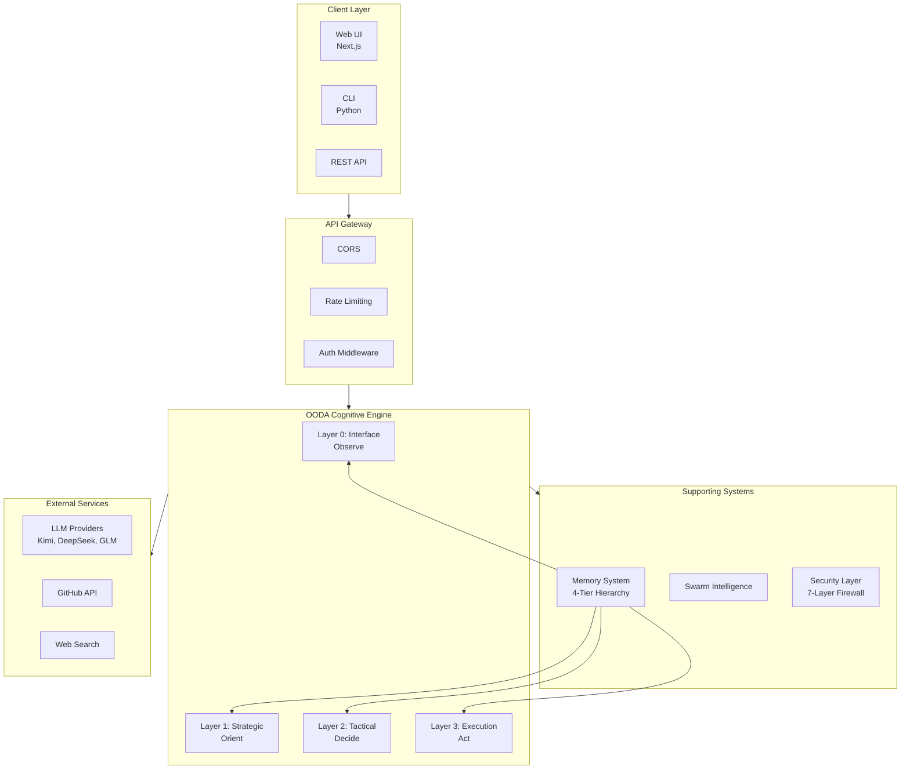
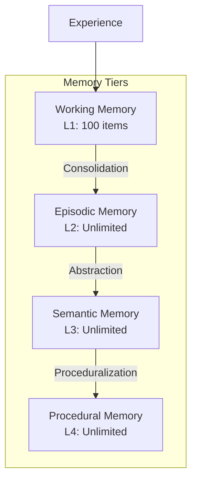
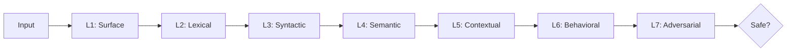
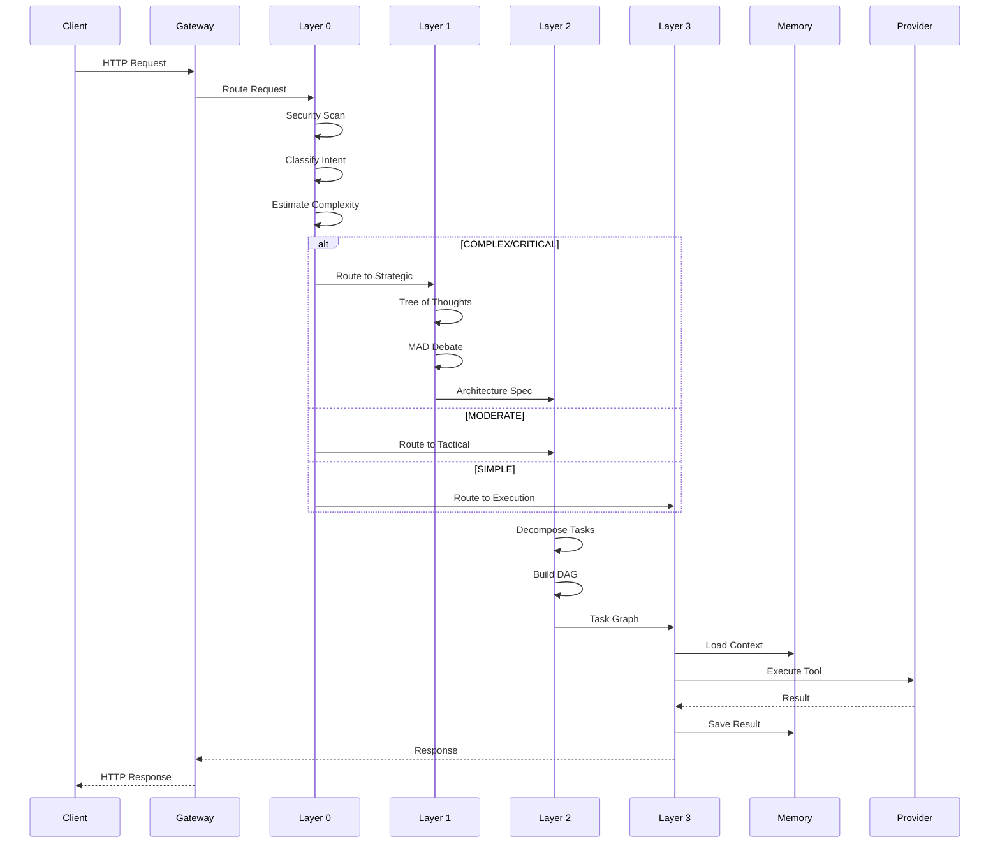

# GAAP Architecture

Deep dive into GAAP's system architecture.

---

## System Architecture Diagram



---

## Component Descriptions

### 1. Client Layer

| Component | Technology | Purpose |
|-----------|------------|---------|
| Web UI | Next.js 16, React 18, TypeScript | User-facing web interface |
| CLI | Python, Click/Argparse | Command-line interface |
| REST API | FastAPI | Programmatic access |

**Key Files:**
- `frontend/src/app/` - Next.js app router
- `gaap/cli/` - CLI commands
- `gaap/api/main.py` - FastAPI application

### 2. API Gateway

Handles cross-cutting concerns:

| Middleware | Purpose |
|------------|---------|
| CORS | Cross-origin resource sharing |
| Rate Limiting | Request throttling (60 req/min default) |
| Auth | API key and JWT validation |
| Request ID | Request tracing |

**Key Files:**
- `gaap/api/main.py` - Middleware setup
- `gaap/security/rate_limiter.py` - Rate limiting

### 3. OODA Cognitive Engine

The core cognitive architecture based on the OODA loop.

#### Layer 0: Interface (Observe)

**Purpose:** Entry point for all requests

| Component | File | Responsibility |
|-----------|------|----------------|
| PromptFirewall | `gaap/security/firewall.py` | 7-layer security scanning |
| IntentClassifier | `gaap/layers/layer0_interface.py` | Intent classification (11 types) |
| ComplexityEstimator | `gaap/layers/layer0_interface.py` | Task complexity scoring |
| SmartRouter | `gaap/routing/router.py` | Dynamic routing |

**Flow:**
```
Input → Security Scan → Intent Classification → Complexity Estimation → Route Decision
```

#### Layer 1: Strategic (Orient)

**Purpose:** High-level strategic planning

| Component | File | Responsibility |
|-----------|------|----------------|
| ToTStrategic | `gaap/layers/layer1_strategic.py` | Tree of Thoughts (depth=5, branch=4) |
| MADPanel | `gaap/mad/critic_prompts.py` | Multi-agent debate (6 critics) |
| MCTSStrategic | `gaap/layers/mcts_logic.py` | Monte Carlo Tree Search |

**Intents:**
1. CODE_GENERATION
2. CODE_REVIEW
3. REFACTORING
4. DEBUGGING
5. ARCHITECTURE_DESIGN
6. TEST_GENERATION
7. DOCUMENTATION
8. RESEARCH
9. LEARNING
10. OPTIMIZATION
11. EXPLORATION

#### Layer 2: Tactical (Decide)

**Purpose:** Task decomposition and planning

| Component | File | Responsibility |
|-----------|------|----------------|
| TacticalDecomposer | `gaap/layers/layer2_tactical.py` | Task breakdown |
| TaskGraph | `gaap/layers/layer2_tactical.py` | DAG construction |
| PhasePlanner | `gaap/layers/phase_planner.py` | Phase discovery |

**Task Categories:**
- SETUP
- DATABASE
- API
- FRONTEND
- TESTING
- SECURITY
- DEPLOYMENT
- DOCUMENTATION

#### Layer 3: Execution (Act)

**Purpose:** Execute tasks with self-healing

| Component | File | Responsibility |
|-----------|------|----------------|
| Layer3Execution | `gaap/layers/layer3_execution.py` | Main execution engine |
| NativeToolCaller | `gaap/layers/native_function_caller.py` | Native tool execution |
| ToolSynthesizer | `gaap/tools/synthesizer.py` | Dynamic tool creation |
| SelfHealingSystem | `gaap/healing/healer.py` | Error recovery |

**Healing Levels:**
1. Retry
2. Refine
3. Replan
4. Fallback

### 4. Memory System

4-tier hierarchical memory inspired by human cognition:



| Tier | Type | Capacity | Purpose |
|------|------|----------|---------|
| L1 | Working | 100 items | Fast access to current context |
| L2 | Episodic | Unlimited | Event history |
| L3 | Semantic | Unlimited | Patterns and knowledge |
| L4 | Procedural | Unlimited | Skills and procedures |

**Dream Cycle:** Consolidates episodic memories into semantic patterns during idle periods.

**Key Files:**
- `gaap/memory/hierarchical.py` - Memory implementation
- `gaap/memory/vector_backends.py` - Vector storage

### 5. Swarm Intelligence

Distributed agent collaboration:

| Component | File | Responsibility |
|-----------|------|----------------|
| Fractal | `gaap/swarm/fractal.py` | Specialized sub-agents |
| ReputationSystem | `gaap/swarm/reputation.py` | Domain-aware reputation |
| Auction | `gaap/swarm/auction.py` | RBTA task allocation |
| Orchestrator | `gaap/swarm/orchestrator.py` | Swarm coordination |

**Fractal States:**
- IDLE → BIDDING → EXECUTING → COOLDOWN → IDLE

### 6. Security Layer

7-layer defense system:



| Layer | Check |
|-------|-------|
| L1 | Basic pattern matching |
| L2 | Token analysis |
| L3 | Structure validation |
| L4 | Meaning analysis |
| L5 | Context verification |
| L6 | Behavior monitoring |
| L7 | Attack simulation |

**Key Files:**
- `gaap/security/firewall.py` - 7-layer firewall
- `gaap/security/sandbox.py` - Sandboxed execution
- `gaap/security/preflight.py` - Input validation

---

## Data Flow

### Request Flow



### OODA Loop Explanation

The OODA loop is the core cognitive cycle:

```
    ┌─────────┐
    │ Observe │◄─────────┐
    └────┬────┘          │
         │               │
         ▼               │
    ┌─────────┐          │
    │ Orient  │          │
    └────┬────┘          │
         │               │
         ▼               │
    ┌─────────┐     ┌────┴────┐
    │ Decide  │────►│   Act   │
    └─────────┘     └────┬────┘
                         │
                         ▼
                    ┌─────────┐
                    │  Learn  │
                    └─────────┘
```

| Phase | Layer | Action |
|-------|-------|--------|
| **Observe** | L0 | Gather input, scan for threats |
| **Orient** | L1 | Analyze context, generate strategy |
| **Decide** | L2 | Break down tasks, plan execution |
| **Act** | L3 | Execute tools, self-heal |
| **Learn** | Meta | Reflect, update reputation |

**Key Insight:** Faster OODA loops beat slower ones. GAAP optimizes for sub-second loop completion.

---

## Database Schema

### Core Tables

```sql
-- Sessions table
CREATE TABLE sessions (
    id TEXT PRIMARY KEY,
    name TEXT NOT NULL,
    description TEXT,
    status TEXT DEFAULT 'pending',
    priority TEXT DEFAULT 'normal',
    tags JSON,
    config JSON,
    metadata JSON,
    created_at TIMESTAMP DEFAULT CURRENT_TIMESTAMP,
    updated_at TIMESTAMP,
    started_at TIMESTAMP,
    completed_at TIMESTAMP,
    progress REAL DEFAULT 0.0,
    tasks_total INTEGER DEFAULT 0,
    tasks_completed INTEGER DEFAULT 0,
    cost_usd REAL DEFAULT 0.0,
    tokens_used INTEGER DEFAULT 0
);

-- Tasks table
CREATE TABLE tasks (
    id TEXT PRIMARY KEY,
    session_id TEXT REFERENCES sessions(id),
    name TEXT NOT NULL,
    status TEXT DEFAULT 'pending',
    priority TEXT DEFAULT 'normal',
    dependencies JSON,
    result JSON,
    created_at TIMESTAMP DEFAULT CURRENT_TIMESTAMP,
    started_at TIMESTAMP,
    completed_at TIMESTAMP
);

-- Memory table
CREATE TABLE memories (
    id TEXT PRIMARY KEY,
    tier TEXT NOT NULL,  -- working, episodic, semantic, procedural
    content TEXT NOT NULL,
    embedding BLOB,
    metadata JSON,
    created_at TIMESTAMP DEFAULT CURRENT_TIMESTAMP,
    access_count INTEGER DEFAULT 0,
    last_accessed TIMESTAMP
);
```

---

## Technology Choices

### Why FastAPI?

- **Performance**: ASGI-based, async support
- **Type Safety**: Native Pydantic integration
- **Documentation**: Auto-generated OpenAPI docs
- **Ecosystem**: Rich middleware ecosystem

### Why SQLite?

- **Simplicity**: Zero configuration
- **Performance**: Excellent for single-node deployments
- **Portability**: Single file database
- **Migration Path**: Easy upgrade to PostgreSQL

### Why Next.js?

- **SSR/SSG**: Flexible rendering options
- **API Routes**: Backend-for-frontend pattern
- **TypeScript**: First-class support
- **Ecosystem**: Large community and ecosystem

### Why OODA?

- **Cognitive Science**: Based on Boyd's OODA loop
- **Adaptability**: Fast iteration beats perfect planning
- **Observability**: Clear phase-based monitoring
- **Extensibility**: Easy to add new layers

---

## Performance Considerations

### Bottlenecks

| Component | Bottleneck | Mitigation |
|-----------|------------|------------|
| LLM Calls | Latency | Caching, parallel calls |
| Database | I/O | Connection pooling, indexing |
| Memory | Search | Vector indexing, tiering |
| WebSocket | Connections | Horizontal scaling |

### Scaling Strategies

1. **Vertical**: More CPU/RAM for single instance
2. **Horizontal**: Multiple instances behind load balancer
3. **Caching**: Redis for session state
4. **CDN**: Static assets

---

## Key Files Reference

| Component | File | Purpose |
|-----------|------|---------|
| Engine | `gaap/gaap_engine.py` | Main OODA loop |
| Config | `gaap/core/config.py` | Configuration management |
| Types | `gaap/core/types.py` | Core type definitions |
| API | `gaap/api/main.py` | FastAPI application |
| WebSocket | `gaap/api/websocket.py` | Real-time communication |

---

## Further Reading

- [Architecture Overview](../../ARCHITECTURE_OVERVIEW.md) - Detailed architecture
- [API Documentation](../api/README.md) - API reference
- [CONTRIBUTING.md](../../CONTRIBUTING.md) - Contribution guide
